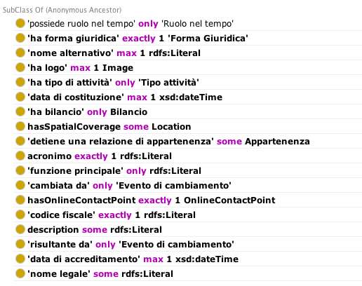

.. _he7c306d40474613287d3656777e1e:

Organizzazioni
**************

.. _h7d7047805a12f41454034755c375870:

Organizzazione
==============

.. _h7d642768304372716448382054487838:

Definizione OpenPA
------------------

Al momento non viene utilizzata in OntoPA: risulta  troppo generica per le finalità degli enti.

.. _h3c36461272362165f1619273548a:

Definizione OntoPiA
-------------------

Riferimento COV-AP_IT:

\ |LINK1|\ 

Questa è la classe che rappresenta un'organizzazione, sia essa pubblica che privata, tipicamente registrata all'interno di un registro pubblico (e.g., indice della PA per le pubbliche amministrazioni, registro imprese per le organizzazioni private). Esempio "Agenzia per l'Italia Digitale", "Comune di Bologna", "TELECOM ITALIA SPA O TIM S.P.A."

\ |IMG1|\ 

.. _h2e3046256ea6a70393b2e1295a6328:

Organizzazione pubblica
=======================

.. _h7d642768304372716448382054487838:

Definizione OpenPA
------------------

Riferimento:

https://www.trentinofamiglia.it/openpa/classes/public_organization

.. _h3c36461272362165f1619273548a:

Definizione OntoPiA
-------------------

Riferimento COV-AP_IT:

\ |LINK2|\ 

Questa classe rappresenta un'organizzazione pubblica. Una pubblica amministrazione e qualsiasi altra organizzazione di natura pubblica può essere modellata utilizzando questa classe. In generale,  individui di questa classe sono organizzazioni registrate presso l'Indice della PA (IPA). Questa classe deriva dall'analoga classe del Core Public Organization Vocabulary.

\ |IMG2|\ 

.. _hd2f1d281c5e3953577c551c87a2445:

Organizzazione privata
======================

.. _h7d642768304372716448382054487838:

Definizione OpenPA
------------------

Riferimento:

\ |LINK3|\ 

Note:

* Punto di contatto è definito da una risorsa esterna: \ |LINK4|\ 

.. _h3c36461272362165f1619273548a:

Definizione OntoPiA
-------------------

Riferimento COV-AP_IT:

\ |LINK5|\ 

Questa classe rappresenta un'organizzazione privata ufficialmente registrata presso un registro nazionale (registro imprese).

\ |IMG3|\ 

.. _h4b54463f647b7d435f207f4b3768:

Associazione
============

.. _h7d642768304372716448382054487838:

Definizione OpenPA
------------------

Riferimento:

.. _h3c36461272362165f1619273548a:

Definizione OntoPiA
-------------------

Vedi organizzazione privata.

.. _h26c59552a54335f271b62d4d1602:

Dipartimento
============

.. _h7d642768304372716448382054487838:

Definizione OpenPA
------------------

[da sistemare]

.. _h3c36461272362165f1619273548a:

Definizione OntoPiA
-------------------

Riferimento COV-AP_IT:

\ |LINK6|\ 

Questa classe rappresenta una generica unità di supporto o unità/divisione dell'organizzazione. Un nome alternativo potrebbe essere anche Dipartimento. Essa, nel contesto italiano, si suddivide in due tipologie di unità di supporto: Area Organizzativa Omogena e Ufficio (unità organizzativa). Questa è una classe astratta istanziata nei dati con i due precedenti tipi.

\ |IMG4|\ 

.. _h22144ff6774f2e297f35665964214:

Area
====

.. _h7d642768304372716448382054487838:

Definizione OpenPA
------------------

.. _h3c36461272362165f1619273548a:

Definizione OntoPiA
-------------------

Riferimento COV-AP_IT:

\ |LINK7|\ 

Questa classe rappresenta una generica unità di supporto o unità/divisione dell'organizzazione. Un nome alternativo potrebbe essere anche Dipartimento. Essa, nel contesto italiano, si suddivide in due tipologie di unità di supporto: Area Organizzativa Omogena e Ufficio (unità organizzativa). Questa è una classe astratta istanziata nei dati con i due precedenti tipi.

.. _h442a7c272a6a7f676c5b5b40362e1921:

Servizio (struttura organizzativa)
==================================

.. _h7d642768304372716448382054487838:

Definizione OpenPA
------------------

.. _h3c36461272362165f1619273548a:

Definizione OntoPiA
-------------------

Riferimento COV-AP_IT:

\ |LINK8|\ 

Questa classe rappresenta una generica unità di supporto o unità/divisione dell'organizzazione. Un nome alternativo potrebbe essere anche Dipartimento. Essa, nel contesto italiano, si suddivide in due tipologie di unità di supporto: Area Organizzativa Omogena e Ufficio (unità organizzativa). Questa è una classe astratta istanziata nei dati con i due precedenti tipi.

.. _h2b206633b2c16212727423e14463c3d:

Ufficio
=======

.. _h7d642768304372716448382054487838:

Definizione OpenPA
------------------

.. _h3c36461272362165f1619273548a:

Definizione OntoPiA
-------------------

Riferimento COV-AP_IT:

\ |LINK9|\ 

Questa classe rappresenta una generica unità di supporto o unità/divisione dell'organizzazione. Un nome alternativo potrebbe essere anche Dipartimento. Essa, nel contesto italiano, si suddivide in due tipologie di unità di supporto: Area Organizzativa Omogena e Ufficio (unità organizzativa). Questa è una classe astratta istanziata nei dati con i due precedenti tipi.

\ |IMG5|\ 

.. bottom of content

.. |LINK1| raw:: html

    <a href="https://github.com/italia/daf-ontologie-vocabolari-controllati/tree/master/Ontologie/COV/v0.10" target="_blank">https://github.com/italia/daf-ontologie-vocabolari-controllati/tree/master/Ontologie/COV/v0.10</a>

.. |LINK2| raw:: html

    <a href="https://github.com/italia/daf-ontologie-vocabolari-controllati/tree/master/Ontologie/COV/v0.10" target="_blank">https://github.com/italia/daf-ontologie-vocabolari-controllati/tree/master/Ontologie/COV/v0.10</a>

.. |LINK3| raw:: html

    <a href="https://www.trentinofamiglia.it/openpa/classes/private_organization" target="_blank">https://www.trentinofamiglia.it/openpa/classes/private_organization</a>

.. |LINK4| raw:: html

    <a href="https://github.com/italia/daf-ontologie-vocabolari-controllati/blob/master/Ontologie/COV/v0.10/COV-AP_IT.rdf#L1779" target="_blank">https://github.com/italia/daf-ontologie-vocabolari-controllati/blob/master/Ontologie/COV/v0.10/COV-AP_IT.rdf#L1779</a>

.. |LINK5| raw:: html

    <a href="https://github.com/italia/daf-ontologie-vocabolari-controllati/tree/master/Ontologie/COV/v0.10" target="_blank">https://github.com/italia/daf-ontologie-vocabolari-controllati/tree/master/Ontologie/COV/v0.10</a>

.. |LINK6| raw:: html

    <a href="https://github.com/italia/daf-ontologie-vocabolari-controllati/tree/master/Ontologie/COV/v0.10" target="_blank">https://github.com/italia/daf-ontologie-vocabolari-controllati/tree/master/Ontologie/COV/v0.10</a>

.. |LINK7| raw:: html

    <a href="https://github.com/italia/daf-ontologie-vocabolari-controllati/tree/master/Ontologie/COV/v0.10" target="_blank">https://github.com/italia/daf-ontologie-vocabolari-controllati/tree/master/Ontologie/COV/v0.10</a>

.. |LINK8| raw:: html

    <a href="https://github.com/italia/daf-ontologie-vocabolari-controllati/tree/master/Ontologie/COV/v0.10" target="_blank">https://github.com/italia/daf-ontologie-vocabolari-controllati/tree/master/Ontologie/COV/v0.10</a>

.. |LINK9| raw:: html

    <a href="https://github.com/italia/daf-ontologie-vocabolari-controllati/tree/master/Ontologie/COV/v0.10" target="_blank">https://github.com/italia/daf-ontologie-vocabolari-controllati/tree/master/Ontologie/COV/v0.10</a>

.. |IMG1| image:: static/Organizzazioni_1.png
   :height: 410 px
   :width: 520 px

.. |IMG2| image:: static/Organizzazioni_2.png
   :height: 116 px
   :width: 610 px

.. |IMG3| image:: static/Organizzazioni_3.png
   :height: 164 px
   :width: 597 px

.. |IMG5| image:: static/Organizzazioni_5.png
   :height: 117 px
   :width: 584 px
