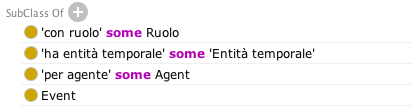
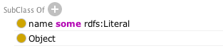
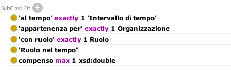
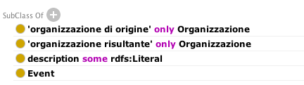

.. _hde1512737cf56543d5d96b3447e:

Altre classi
************

.. _h3c384e643f47203b3a2c3a7735401a72:

Ruolo nel tempo
===============

.. _h7d642768304372716448382054487838:

Definizione OpenPA
------------------

Mancante, da fare

.. _h3c36461272362165f1619273548a:

Definizione OntoPiA
-------------------

Riferimento COV-AP_IT:

\ |LINK1|\ 

Rappresentazione di un ruolo associato ad un intervallo temporale determinato.

\ |IMG1|\ 

.. _h6f56334e2b194b6b9292496971203:

Ruolo
=====

.. _h7d642768304372716448382054487838:

Definizione OpenPA
------------------

Da rivedere… di fatto non ancora usato

.. _h3c36461272362165f1619273548a:

Definizione OntoPiA
-------------------

Riferimento COV-AP_IT:

\ |LINK2|\ 

Questa classe è definita in http://dati.gov.it/onto/roapit/ e, in questa ontologia, rappresenta il ruolo nella relazione ennaria con l'Agente, l'Organizzazione, e la situazione di Appartenenza. Essa è utilizzata per modellare il Ruolo di un membro dell'organizzazione in un certo intervallo temporale.

\ |IMG2|\ 

.. _h62115463455271f543ce6c483f305d:

Appartenenza
============

.. _h7d642768304372716448382054487838:

Definizione OpenPA
------------------

Mancante, da fare

.. _h3c36461272362165f1619273548a:

Definizione OntoPiA
-------------------

Riferimento COV-AP_IT:

\ |LINK3|\ 

Questa classe rappresenta la natura di appartenenza di un agente di un'organizzazione. In particolare, la classe è una relazione ennaria che rappresenta una situazione che coinvolge un agente, un'organizzazione, i l ruolo che l'agente ricopre nell'organizzazione ed eventualmente il lasso temporale in cui quel ruolo è svolto. Esempio: la classe consente di rappresentare il ruolo di amministratore delegato  di un'impresa in un certo lasso temporale oppure il ruolo di consigliere in una società partecipata di una pubblica amministrazione in un certo intervallo temporale.

\ |IMG3|\ 

.. _h795f2c3a64d6b45f1b72746e4f4880:

Evento di cambiamento
=====================

.. _h7d642768304372716448382054487838:

Definizione OpenPA
------------------

Mancante, da fare

.. _h6765729b4c61241e217220a47456c:

Problema da risolvere
---------------------

Le organizzazioni private di Trentino Famiglia cambiano nome nel corso del tempo; come gestire questo cambiamento?

.. _h3c36461272362165f1619273548a:

Definizione OntoPiA
-------------------

Riferimento COV-AP_IT:

\ |LINK4|\ 

Organizzazioni sono formate o cambiano in risposta ad eventi. Questo potrebbe essere il risultato di nuove normative, di nuove obbligazioni, di riassetti ecc. Questa classe mira a catturare questi tipi di eventi di cambiamento nell'organizzazione. In particolare, al momento si sono individuati i seguenti tipi di eventi: Fondazione, Chiusura, Fusione, Scissione, Sostituzione. La semantica di questa classe è la stessa di quella fornita nell'ambito del vocabolario europeo Core Public Organization Vocabulary.

\ |IMG4|\ 

.. bottom of content

.. |LINK1| raw:: html

    <a href="https://github.com/italia/daf-ontologie-vocabolari-controllati/tree/master/Ontologie/COV/v0.10" target="_blank">https://github.com/italia/daf-ontologie-vocabolari-controllati/tree/master/Ontologie/COV/v0.10</a>

.. |LINK2| raw:: html

    <a href="https://github.com/italia/daf-ontologie-vocabolari-controllati/tree/master/Ontologie/COV/v0.10" target="_blank">https://github.com/italia/daf-ontologie-vocabolari-controllati/tree/master/Ontologie/COV/v0.10</a>

.. |LINK3| raw:: html

    <a href="https://github.com/italia/daf-ontologie-vocabolari-controllati/tree/master/Ontologie/COV/v0.10" target="_blank">https://github.com/italia/daf-ontologie-vocabolari-controllati/tree/master/Ontologie/COV/v0.10</a>

.. |LINK4| raw:: html

    <a href="https://github.com/italia/daf-ontologie-vocabolari-controllati/tree/master/Ontologie/COV/v0.10" target="_blank">https://github.com/italia/daf-ontologie-vocabolari-controllati/tree/master/Ontologie/COV/v0.10</a>

