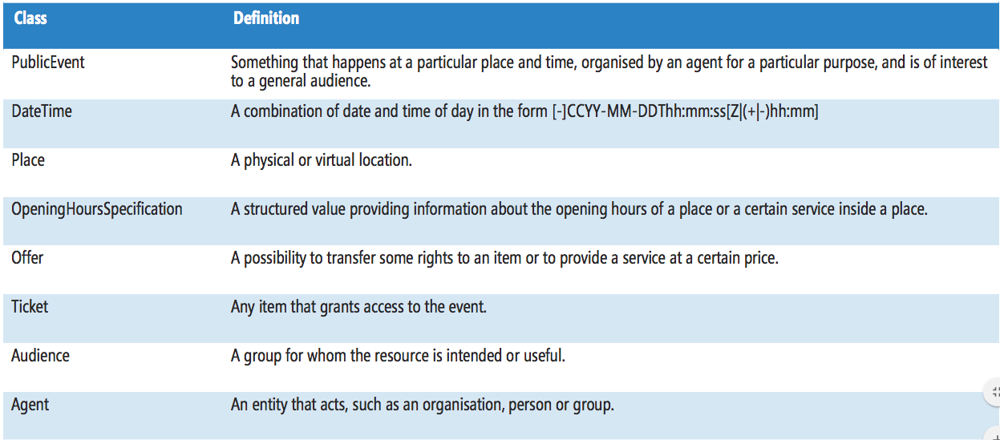
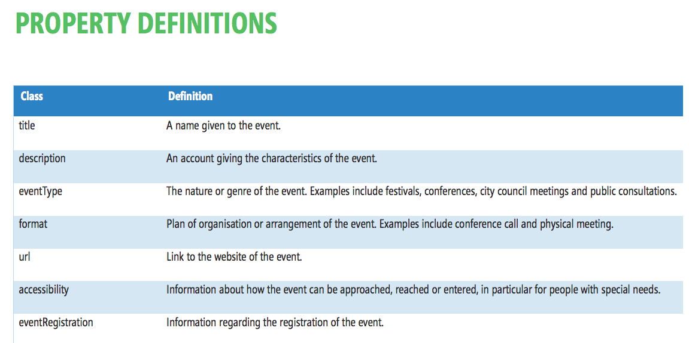
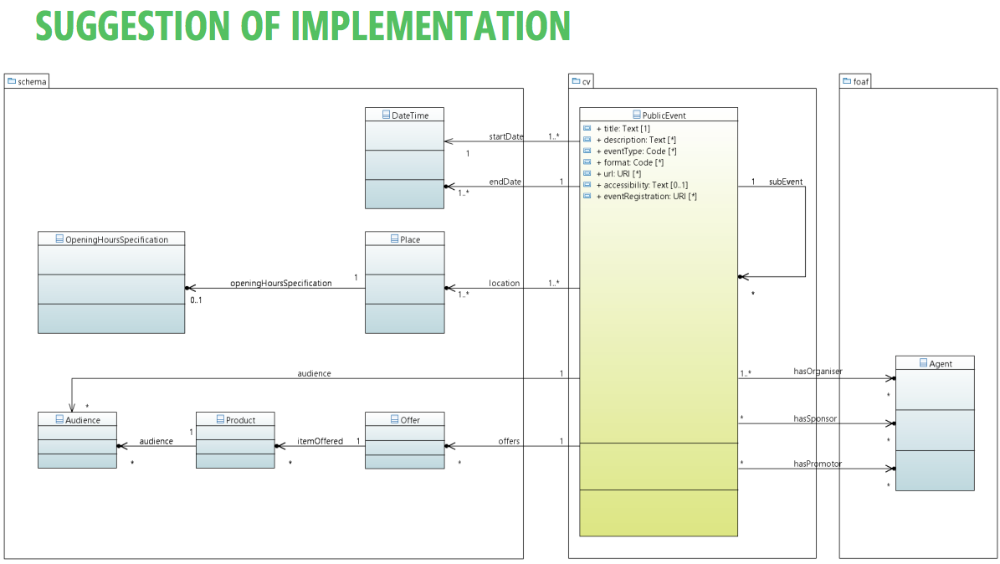

.. _h3c3b5c2c7a77eb14d6f5d37254753:

Eventi pubblici (CPEV-AP_IT)
****************************

.. _h2b556c2096b794756701a202c4b3915:

Evento
======

..  Caution:: 

    Classi in attesa di CPEV-AP_IT definitivo

+-------------+---------------------------------------------------------------------------------------------------------------------------------------------------------------------+---------------------------------------------------------------+------------+
|\ |STYLE0|\  |\ |STYLE1|\                                                                                                                                                          |\ |STYLE2|\                                                    |\ |STYLE3|\ |
+-------------+---------------------------------------------------------------------------------------------------------------------------------------------------------------------+---------------------------------------------------------------+------------+
|\ |STYLE4|\  |Titolo dell'evento (massimo 250 caratteri, spazi inclusi)                                                                                                            |Linea di testo (ezstring)                                      |X           |
+-------------+---------------------------------------------------------------------------------------------------------------------------------------------------------------------+---------------------------------------------------------------+------------+
|\ |STYLE5|\  |Titolo sintetico dell'evento (massimo 100 caratteri, spazi inclusi)                                                                                                  |Linea di testo (ezstring)                                      |            |
+-------------+---------------------------------------------------------------------------------------------------------------------------------------------------------------------+---------------------------------------------------------------+------------+
|\ |STYLE6|\  |Immagine principale dell'evento; assicurati che sia compatibile con i termini di utilizzo definiti dal Comune: https://openagenda.comune.palermo.it/agenda/info/terms|Immagine (ezimage)                                             |X           |
+-------------+---------------------------------------------------------------------------------------------------------------------------------------------------------------------+---------------------------------------------------------------+------------+
|\ |STYLE7|\  |Descrizione breve dell'evento (consigliato: dai 150 ai 180 caratteri)                                                                                                |Blocco XML (ezxmltext)                                         |X           |
+-------------+---------------------------------------------------------------------------------------------------------------------------------------------------------------------+---------------------------------------------------------------+------------+
|\ |STYLE8|\  |Descrizione completa dell'evento. Non ci sono limiti di caratteri, ti consigliamo di essere più dettagliato possibile                                                |Blocco XML (ezxmltext)                                         |            |
+-------------+---------------------------------------------------------------------------------------------------------------------------------------------------------------------+---------------------------------------------------------------+------------+
|\ |STYLE9|\  |                                                                                                                                                                     |Relazioni oggetti                                              |            |
|             |                                                                                                                                                                     |(ezobjectrelationlist)                                         |            |
|             |                                                                                                                                                                     |[Organizzazione pubblica][Organizzazione privata]              |            |
+-------------+---------------------------------------------------------------------------------------------------------------------------------------------------------------------+---------------------------------------------------------------+------------+
|\ |STYLE10|\ |Organizzatore e promotore dell'evento                                                                                                                                |Relazioni oggetti (ezobjectrelationlist)                       |X           |
|             |                                                                                                                                                                     |[Organizzazione pubblica][Organizzazione privata][Associazione]|            |
+-------------+---------------------------------------------------------------------------------------------------------------------------------------------------------------------+---------------------------------------------------------------+------------+
|\ |STYLE11|\ |Locandina/manifesto, in formato PDF (dimensione massima: 4Mb)                                                                                                        |File (ezbinaryfile)                                            |            |
+-------------+---------------------------------------------------------------------------------------------------------------------------------------------------------------------+---------------------------------------------------------------+------------+
|\ |STYLE12|\ |Data e ora di inizio dell'evento                                                                                                                                     |Data e ora (ezdatetime)                                        |X           |
+-------------+---------------------------------------------------------------------------------------------------------------------------------------------------------------------+---------------------------------------------------------------+------------+
|\ |STYLE13|\ |Data e ora di termine dell'evento                                                                                                                                    |Data e ora (ezdatetime)                                        |X           |
+-------------+---------------------------------------------------------------------------------------------------------------------------------------------------------------------+---------------------------------------------------------------+------------+
|\ |STYLE14|\ |Ulteriori indicazioni relative alla data dell'evento (nel caso in cui le date sopra indicate non siano sufficientemente precise)                                     |Linea di testo (ezstring)                                      |            |
+-------------+---------------------------------------------------------------------------------------------------------------------------------------------------------------------+---------------------------------------------------------------+------------+
|\ |STYLE15|\ |Durata dell'evento in formato leggibile, ad es: due ore                                                                                                              |Linea di testo (ezstring)                                      |            |
+-------------+---------------------------------------------------------------------------------------------------------------------------------------------------------------------+---------------------------------------------------------------+------------+
|\ |STYLE16|\ |Ulteriori informazioni sul periodo in cui si svolge l'evento - in formato leggibile                                                                                  |Linea di testo (ezstring)                                      |            |
+-------------+---------------------------------------------------------------------------------------------------------------------------------------------------------------------+---------------------------------------------------------------+------------+
|\ |STYLE17|\ |Indicare l'eventuale luogo della cultura in cui si svolge l'evento (ha priorità rispetto alle informazioni inserite dopo)                                            |Relazioni oggetti (ezobjectrelationlist)                       |            |
|             |                                                                                                                                                                     |[Luogo]                                                        |            |
+-------------+---------------------------------------------------------------------------------------------------------------------------------------------------------------------+---------------------------------------------------------------+------------+
|\ |STYLE18|\ |Indicare il quartiere o la zona della città in cui si svolge l'evento                                                                                                |Relazioni oggetti (ezobjectrelationlist)                       |            |
|             |                                                                                                                                                                     |[Punto di interesse]                                           |            |
+-------------+---------------------------------------------------------------------------------------------------------------------------------------------------------------------+---------------------------------------------------------------+------------+
|\ |STYLE19|\ |Indicare l'indirizzo completo presso il quale si svolge l'evento (es. Via Nunzio Nasi 18, Palermo)                                                                   |Linea di testo (ezstring)                                      |            |
+-------------+---------------------------------------------------------------------------------------------------------------------------------------------------------------------+---------------------------------------------------------------+------------+
|\ |STYLE20|\ |Georeferenziazione del luogo in cui si svolge l'evento                                                                                                               |Localizzazione GMap (ezgmaplocation)                           |X           |
+-------------+---------------------------------------------------------------------------------------------------------------------------------------------------------------------+---------------------------------------------------------------+------------+
|\ |STYLE21|\ |Informazioni generali sull'evento                                                                                                                                    |Blocco XML (ezxmltext)                                         |            |
+-------------+---------------------------------------------------------------------------------------------------------------------------------------------------------------------+---------------------------------------------------------------+------------+
|\ |STYLE22|\ |                                                                                                                                                                     |Tags (eztags)                                                  |X           |
|             |                                                                                                                                                                     |Vocabolario controllato                                        |            |
+-------------+---------------------------------------------------------------------------------------------------------------------------------------------------------------------+---------------------------------------------------------------+------------+
|\ |STYLE23|\ |Target utenti dell'evento in formato descrittivo                                                                                                                     |Blocco di testo (eztext)                                       |            |
+-------------+---------------------------------------------------------------------------------------------------------------------------------------------------------------------+---------------------------------------------------------------+------------+
|\ |STYLE24|\ |                                                                                                                                                                     |Tags (eztags)                                                  |            |
|             |                                                                                                                                                                     |Vocabolario contollato                                         |            |
+-------------+---------------------------------------------------------------------------------------------------------------------------------------------------------------------+---------------------------------------------------------------+------------+
|\ |STYLE25|\ |Indicare eventuali costi di accesso all'evento                                                                                                                       |Linea di testo (ezstring)                                      |            |
+-------------+---------------------------------------------------------------------------------------------------------------------------------------------------------------------+---------------------------------------------------------------+------------+
|\ |STYLE26|\ |                                                                                                                                                                     |Linea di testo (ezstring)                                      |            |
+-------------+---------------------------------------------------------------------------------------------------------------------------------------------------------------------+---------------------------------------------------------------+------------+
|\ |STYLE27|\ |Concetti più significativi riguardanti il contenuto                                                                                                                  |Parole chiave (ezkeyword)                                      |            |
+-------------+---------------------------------------------------------------------------------------------------------------------------------------------------------------------+---------------------------------------------------------------+------------+
|\ |STYLE28|\ |                                                                                                                                                                     |Relazioni oggetti (ezobjectrelationlist)                       |            |
|             |                                                                                                                                                                     |[Organo politico]                                              |            |
+-------------+---------------------------------------------------------------------------------------------------------------------------------------------------------------------+---------------------------------------------------------------+------------+
|\ |STYLE29|\ |Evento o manifestazione correlata                                                                                                                                    |Relazioni oggetti (ezobjectrelationlist)                       |            |
|             |                                                                                                                                                                     |[Evento]                                                       |            |
+-------------+---------------------------------------------------------------------------------------------------------------------------------------------------------------------+---------------------------------------------------------------+------------+
|\ |STYLE30|\ |                                                                                                                                                                     |Linea di testo (ezstring)                                      |            |
+-------------+---------------------------------------------------------------------------------------------------------------------------------------------------------------------+---------------------------------------------------------------+------------+
|\ |STYLE31|\ |Fonte delle informazioni riportate                                                                                                                                   |Linea di testo (ezstring)                                      |            |
+-------------+---------------------------------------------------------------------------------------------------------------------------------------------------------------------+---------------------------------------------------------------+------------+
|\ |STYLE32|\ |                                                                                                                                                                     |Relazioni oggetti (ezobjectrelationlist)                       |            |
|             |                                                                                                                                                                     |[Immagine]                                                     |            |
+-------------+---------------------------------------------------------------------------------------------------------------------------------------------------------------------+---------------------------------------------------------------+------------+
|\ |STYLE33|\ |Contatto telefonico di riferimento                                                                                                                                   |Linea di testo (ezstring)                                      |            |
+-------------+---------------------------------------------------------------------------------------------------------------------------------------------------------------------+---------------------------------------------------------------+------------+
|\ |STYLE34|\ |Contatto fax di riferimento                                                                                                                                          |Linea di testo (ezstring)                                      |            |
+-------------+---------------------------------------------------------------------------------------------------------------------------------------------------------------------+---------------------------------------------------------------+------------+
|\ |STYLE35|\ |Contatto email di riferimento                                                                                                                                        |Email (ezemail)                                                |            |
+-------------+---------------------------------------------------------------------------------------------------------------------------------------------------------------------+---------------------------------------------------------------+------------+
|\ |STYLE36|\ |Sito web dedicato all'evento (specificare il link e il testo sul quale comparirà il link)                                                                            |URL (ezurl)                                                    |            |
+-------------+---------------------------------------------------------------------------------------------------------------------------------------------------------------------+---------------------------------------------------------------+------------+
|\ |STYLE37|\ |                                                                                                                                                                     |Star Rating (ezsrrating)                                       |            |
+-------------+---------------------------------------------------------------------------------------------------------------------------------------------------------------------+---------------------------------------------------------------+------------+

\ |STYLE38|\ 

* Organo politico

* Organizzazione pubblica

* Organizzazione privata

* Associazione

* Immagine

* Evento

* Punto di interesse (quartiere)

* Luogo

\ |STYLE39|\ 

* Target utenti: adulti, anziani, bambini, famiglia, genitori, giovani, studenti

* Tipologia di evento: \ |LINK1|\  

..  Error:: 

    L’evento va corretto utilizzando anche le classi correlate:
    
    * Costo / ticket
    
    * Punto di contatto (principale dell’evento)
    
    * Articolo (news, approfondimento)

.. _h5e5bd216a61325a7f6a772520657725:

Proposta CORE PUBLIC EVENT VOCABULARY
=====================================

\ |IMG1|\ 

\ |IMG2|\ 

\ |IMG3|\ 

.. bottom of content

.. |STYLE0| replace:: **Attributo**

.. |STYLE1| replace:: **Descrizione**

.. |STYLE2| replace:: **Datatype**

.. |STYLE3| replace:: **Obbl.**

.. |STYLE4| replace:: **Titolo (titolo)**

.. |STYLE5| replace:: **Titolo breve (short_title)**

.. |STYLE6| replace:: **Immagine (image)**

.. |STYLE7| replace:: **Descrizione breve (abstract)**

.. |STYLE8| replace:: **Descrizione completa (text)**

.. |STYLE9| replace:: **Patrocinato da (patrocinio)**

.. |STYLE10| replace:: **Organizzato da (organizzazione)**

.. |STYLE11| replace:: **Locandina dell'evento (file)**

.. |STYLE12| replace:: **Inizio (from_time)**

.. |STYLE13| replace:: **Termine (to_time)**

.. |STYLE14| replace:: **Note sull’orario (orario_svolgimento)**

.. |STYLE15| replace:: **Durata (durata)**

.. |STYLE16| replace:: **Dettagli sul periodo di svolgimento (periodo_svolgimento)**

.. |STYLE17| replace:: **Luogo (location)**

.. |STYLE18| replace:: **Quartiere / Zona (quartiere)**

.. |STYLE19| replace:: **Indirizzo (luogo_svolgimento)**

.. |STYLE20| replace:: **Posizione geografica (geo)**

.. |STYLE21| replace:: **Ulteriori informazioni (informazioni)**

.. |STYLE22| replace:: **Tipologia evento (tipo_evento)**

.. |STYLE23| replace:: **Destinatari (destinatari)**

.. |STYLE24| replace:: **Target utenti (target)**

.. |STYLE25| replace:: **Costo d'ingresso (costi)**

.. |STYLE26| replace:: **Stato (stato)**

.. |STYLE27| replace:: **Parole chiave (materia)**

.. |STYLE28| replace:: **Circoscrizione (circoscrizione)**

.. |STYLE29| replace:: **Manifestazione cui fa parte (iniziativa)**

.. |STYLE30| replace:: **Progressivo (progressivo)**

.. |STYLE31| replace:: **Fonte (fonte)**

.. |STYLE32| replace:: **Galleria (images)**

.. |STYLE33| replace:: **Telefono (telefono)**

.. |STYLE34| replace:: **Fax (fax)**

.. |STYLE35| replace:: **Email (email)**

.. |STYLE36| replace:: **Sito web (url)**

.. |STYLE37| replace:: **Valutazione dell'utente (rating)**

.. |STYLE38| replace:: **Classi correlate**

.. |STYLE39| replace:: **Vocabolari controllati**

.. |LINK1| raw:: html

    <a href="http://ontopa.opencontent.it/API-Vocabolari-controllati/Tipologie-di-eventi-pubblici" target="_blank">http://ontopa.opencontent.it/API-Vocabolari-controllati/Tipologie-di-eventi-pubblici</a>

