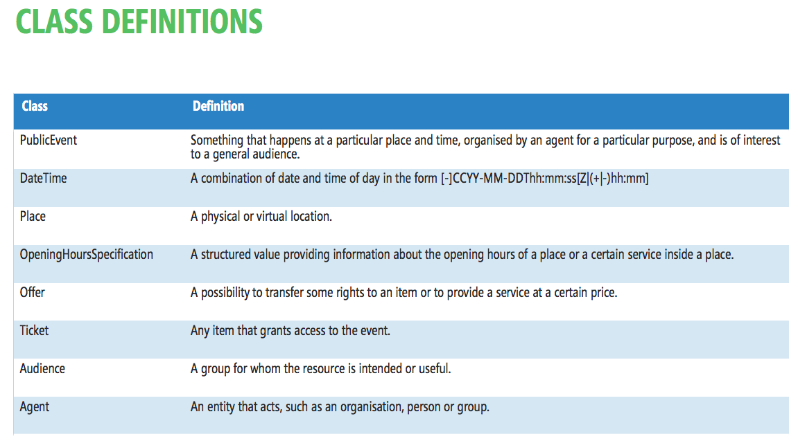

.. _h3c3b5c2c7a77eb14d6f5d37254753:

Eventi pubblici (CPEV-AP_IT)
****************************

.. _h2b556c2096b794756701a202c4b3915:

Evento
======

..  Caution:: 

    Classi in attesa di CPEV-AP_IT definitivo

|REPLACE1|

\ |STYLE0|\ 

* Organo politico

* Organizzazione pubblica

* Organizzazione privata

* Associazione

* Immagine

* Evento

* Punto di interesse (quartiere)

* Luogo

\ |STYLE1|\ 

* Target utenti: adulti, anziani, bambini, famiglia, genitori, giovani, studenti

* Tipologia di evento: \ |LINK1|\  

..  Error:: 

    L’evento va corretto utilizzando anche le classi correlate:
    
    * Costo / ticket
    
    * Punto di contatto (principale dell’evento)
    
    * Articolo (news, approfondimento)

.. _h5e5bd216a61325a7f6a772520657725:

Proposta CORE PUBLIC EVENT VOCABULARY
=====================================

\ |IMG1|\ 

\ |IMG2|\ 

\ |IMG3|\ 

.. bottom of content

.. |STYLE0| replace:: **Classi correlate**

.. |STYLE1| replace:: **Vocabolari controllati**

.. |REPLACE1| raw:: html

    <table cellspacing="0" cellpadding="0" style="width:90%">
    <tbody>
    <tr><td style="text-align:center;width:21%;background-color:#6aa84f;color:#ffffff;vertical-align:Center;padding-top:6px;padding-bottom:6px;padding-left:6px;padding-right:6px;border:solid 0.5px #000000">
Attributo
</td><td style="text-align:center;width:46%;background-color:#6aa84f;color:#ffffff;vertical-align:Center;padding-top:6px;padding-bottom:6px;padding-left:6px;padding-right:6px;border:solid 0.5px #000000">
Descrizione
</td><td style="text-align:center;width:23%;background-color:#6aa84f;color:#ffffff;vertical-align:Center;padding-top:6px;padding-bottom:6px;padding-left:6px;padding-right:6px;border:solid 0.5px #000000">
Datatype
</td><td style="text-align:center;width:10%;background-color:#6aa84f;color:#ffffff;vertical-align:Center;padding-top:6px;padding-bottom:6px;padding-left:6px;padding-right:6px;border:solid 0.5px #000000">
Obbl.
</td></tr>
    <tr><td style="text-align:center;vertical-align:Center;padding-top:6px;padding-bottom:6px;padding-left:6px;padding-right:6px;border:solid 0.5px #000000">
Titolo (titolo)
</td><td style="text-align:center;vertical-align:Center;padding-top:6px;padding-bottom:6px;padding-left:6px;padding-right:6px;border:solid 0.5px #000000">
Titolo dell'evento (massimo 250 caratteri, spazi inclusi)
</td><td style="text-align:center;vertical-align:Center;padding-top:6px;padding-bottom:6px;padding-left:6px;padding-right:6px;border:solid 0.5px #000000">
Linea di testo (ezstring)
</td><td style="text-align:center;vertical-align:Center;padding-top:6px;padding-bottom:6px;padding-left:6px;padding-right:6px;border:solid 0.5px #000000">
X
</td></tr>
    <tr><td style="text-align:center;vertical-align:Center;padding-top:6px;padding-bottom:6px;padding-left:6px;padding-right:6px;border:solid 0.5px #000000">
Titolo breve (short_title)
</td><td style="text-align:center;vertical-align:Center;padding-top:6px;padding-bottom:6px;padding-left:6px;padding-right:6px;border:solid 0.5px #000000">
Titolo sintetico dell'evento (massimo 100 caratteri, spazi inclusi)
</td><td style="text-align:center;vertical-align:Center;padding-top:6px;padding-bottom:6px;padding-left:6px;padding-right:6px;border:solid 0.5px #000000">
Linea di testo (ezstring)
</td><td style="text-align:center;vertical-align:Center;padding-top:6px;padding-bottom:6px;padding-left:6px;padding-right:6px;border:solid 0.5px #000000">
</td></tr>
    <tr><td style="text-align:center;vertical-align:Center;padding-top:6px;padding-bottom:6px;padding-left:6px;padding-right:6px;border:solid 0.5px #000000">
Immagine (image)
</td><td style="text-align:center;vertical-align:Center;padding-top:6px;padding-bottom:6px;padding-left:6px;padding-right:6px;border:solid 0.5px #000000">
Immagine principale dell'evento; assicurati che sia compatibile con i termini di utilizzo definiti dal Comune: https://openagenda.comune.palermo.it/agenda/info/terms
</td><td style="text-align:center;vertical-align:Center;padding-top:6px;padding-bottom:6px;padding-left:6px;padding-right:6px;border:solid 0.5px #000000">
Immagine (ezimage)
</td><td style="text-align:center;vertical-align:Center;padding-top:6px;padding-bottom:6px;padding-left:6px;padding-right:6px;border:solid 0.5px #000000">
X
</td></tr>
    <tr><td style="text-align:center;vertical-align:Center;padding-top:6px;padding-bottom:6px;padding-left:6px;padding-right:6px;border:solid 0.5px #000000">
Descrizione breve (abstract)
</td><td style="text-align:center;vertical-align:Center;padding-top:6px;padding-bottom:6px;padding-left:6px;padding-right:6px;border:solid 0.5px #000000">
Descrizione breve dell'evento (consigliato: dai 150 ai 180 caratteri)
</td><td style="text-align:center;vertical-align:Center;padding-top:6px;padding-bottom:6px;padding-left:6px;padding-right:6px;border:solid 0.5px #000000">
Blocco XML (ezxmltext)
</td><td style="text-align:center;vertical-align:Center;padding-top:6px;padding-bottom:6px;padding-left:6px;padding-right:6px;border:solid 0.5px #000000">
X
</td></tr>
    <tr><td style="text-align:center;vertical-align:Center;padding-top:6px;padding-bottom:6px;padding-left:6px;padding-right:6px;border:solid 0.5px #000000">
Descrizione completa (text)
</td><td style="text-align:center;vertical-align:Center;padding-top:6px;padding-bottom:6px;padding-left:6px;padding-right:6px;border:solid 0.5px #000000">
Descrizione completa dell'evento. Non ci sono limiti di caratteri, ti consigliamo di essere più dettagliato possibile
</td><td style="text-align:center;vertical-align:Center;padding-top:6px;padding-bottom:6px;padding-left:6px;padding-right:6px;border:solid 0.5px #000000">
Blocco XML (ezxmltext)
</td><td style="text-align:center;vertical-align:Center;padding-top:6px;padding-bottom:6px;padding-left:6px;padding-right:6px;border:solid 0.5px #000000">
</td></tr>
    <tr><td style="text-align:center;vertical-align:Center;padding-top:6px;padding-bottom:6px;padding-left:6px;padding-right:6px;border:solid 0.5px #000000">
Patrocinato da (patrocinio)
</td><td style="text-align:center;vertical-align:Center;padding-top:6px;padding-bottom:6px;padding-left:6px;padding-right:6px;border:solid 0.5px #000000">
</td><td style="text-align:center;vertical-align:Center;padding-top:6px;padding-bottom:6px;padding-left:6px;padding-right:6px;border:solid 0.5px #000000">
Relazioni oggetti (ezobjectrelationlist) [Organizzazione pubblica][Organizzazione privata]
</td><td style="text-align:center;vertical-align:Center;padding-top:6px;padding-bottom:6px;padding-left:6px;padding-right:6px;border:solid 0.5px #000000">
</td></tr>
    <tr><td style="text-align:center;vertical-align:Center;padding-top:6px;padding-bottom:6px;padding-left:6px;padding-right:6px;border:solid 0.5px #000000">
Organizzato da (organizzazione)
</td><td style="text-align:center;vertical-align:Center;padding-top:6px;padding-bottom:6px;padding-left:6px;padding-right:6px;border:solid 0.5px #000000">
Organizzatore e promotore dell'evento
</td><td style="text-align:center;vertical-align:Center;padding-top:6px;padding-bottom:6px;padding-left:6px;padding-right:6px;border:solid 0.5px #000000">
Relazioni oggetti (ezobjectrelationlist) [Organizzazione pubblica][Organizzazione privata][Associazione]
</td><td style="text-align:center;vertical-align:Center;padding-top:6px;padding-bottom:6px;padding-left:6px;padding-right:6px;border:solid 0.5px #000000">
X
</td></tr>
    <tr><td style="text-align:center;vertical-align:Center;padding-top:6px;padding-bottom:6px;padding-left:6px;padding-right:6px;border:solid 0.5px #000000">
Locandina dell'evento (file)
</td><td style="text-align:center;vertical-align:Center;padding-top:0px;padding-bottom:0px;padding-left:0px;padding-right:0px;border:solid 0.5px #000000">
Locandina/manifesto, in formato PDF (dimensione massima: 4Mb)
</td><td style="text-align:center;vertical-align:Center;padding-top:6px;padding-bottom:6px;padding-left:6px;padding-right:6px;border:solid 0.5px #000000">
File (ezbinaryfile)
</td><td style="text-align:center;vertical-align:Center;padding-top:6px;padding-bottom:6px;padding-left:6px;padding-right:6px;border:solid 0.5px #000000">
</td></tr>
    <tr><td style="text-align:center;vertical-align:Center;padding-top:6px;padding-bottom:6px;padding-left:6px;padding-right:6px;border:solid 0.5px #000000">
Inizio (from_time)
</td><td style="text-align:center;vertical-align:Center;padding-top:6px;padding-bottom:6px;padding-left:6px;padding-right:6px;border:solid 0.5px #000000">
Data e ora di inizio dell'evento
</td><td style="text-align:center;vertical-align:Center;padding-top:6px;padding-bottom:6px;padding-left:6px;padding-right:6px;border:solid 0.5px #000000">
Data e ora (ezdatetime)
</td><td style="text-align:center;vertical-align:Center;padding-top:6px;padding-bottom:6px;padding-left:6px;padding-right:6px;border:solid 0.5px #000000">
X
</td></tr>
    <tr><td style="text-align:center;vertical-align:Center;padding-top:6px;padding-bottom:6px;padding-left:6px;padding-right:6px;border:solid 0.5px #000000">
Termine (to_time)
</td><td style="text-align:center;vertical-align:Center;padding-top:6px;padding-bottom:6px;padding-left:6px;padding-right:6px;border:solid 0.5px #000000">
Data e ora di termine dell'evento
</td><td style="text-align:center;vertical-align:Center;padding-top:6px;padding-bottom:6px;padding-left:6px;padding-right:6px;border:solid 0.5px #000000">
Data e ora (ezdatetime)
</td><td style="text-align:center;vertical-align:Center;padding-top:6px;padding-bottom:6px;padding-left:6px;padding-right:6px;border:solid 0.5px #000000">
X
</td></tr>
    <tr><td style="text-align:center;vertical-align:Center;padding-top:6px;padding-bottom:6px;padding-left:6px;padding-right:6px;border:solid 0.5px #000000">
Note sull’orario (orario_svolgimento)
</td><td style="text-align:center;vertical-align:Center;padding-top:6px;padding-bottom:6px;padding-left:6px;padding-right:6px;border:solid 0.5px #000000">
Ulteriori indicazioni relative alla data dell'evento (nel caso in cui le date sopra indicate non siano sufficientemente precise)
</td><td style="text-align:center;vertical-align:Center;padding-top:6px;padding-bottom:6px;padding-left:6px;padding-right:6px;border:solid 0.5px #000000">
Linea di testo (ezstring)
</td><td style="text-align:center;vertical-align:Center;padding-top:6px;padding-bottom:6px;padding-left:6px;padding-right:6px;border:solid 0.5px #000000">
</td></tr>
    <tr><td style="text-align:center;vertical-align:Center;padding-top:6px;padding-bottom:6px;padding-left:6px;padding-right:6px;border:solid 0.5px #000000">
Durata (durata)
</td><td style="text-align:center;vertical-align:Center;padding-top:6px;padding-bottom:6px;padding-left:6px;padding-right:6px;border:solid 0.5px #000000">
Durata dell'evento in formato leggibile, ad es: due ore
</td><td style="text-align:center;vertical-align:Center;padding-top:6px;padding-bottom:6px;padding-left:6px;padding-right:6px;border:solid 0.5px #000000">
Linea di testo (ezstring)
</td><td style="text-align:center;vertical-align:Center;padding-top:6px;padding-bottom:6px;padding-left:6px;padding-right:6px;border:solid 0.5px #000000">
</td></tr>
    <tr><td style="text-align:center;vertical-align:Center;padding-top:6px;padding-bottom:6px;padding-left:6px;padding-right:6px;border:solid 0.5px #000000">
Dettagli sul periodo di svolgimento (periodo_svolgimento)
</td><td style="text-align:center;vertical-align:Center;padding-top:6px;padding-bottom:6px;padding-left:6px;padding-right:6px;border:solid 0.5px #000000">
Ulteriori informazioni sul periodo in cui si svolge l'evento - in formato leggibile
</td><td style="text-align:center;vertical-align:Center;padding-top:6px;padding-bottom:6px;padding-left:6px;padding-right:6px;border:solid 0.5px #000000">
Linea di testo (ezstring)
</td><td style="text-align:center;vertical-align:Center;padding-top:6px;padding-bottom:6px;padding-left:6px;padding-right:6px;border:solid 0.5px #000000">
</td></tr>
    <tr><td style="text-align:center;vertical-align:Center;padding-top:6px;padding-bottom:6px;padding-left:6px;padding-right:6px;border:solid 0.5px #000000">
Luogo (location)
</td><td style="text-align:center;vertical-align:Center;padding-top:6px;padding-bottom:6px;padding-left:6px;padding-right:6px;border:solid 0.5px #000000">
Indicare l'eventuale luogo della cultura in cui si svolge l'evento (ha priorità rispetto alle informazioni inserite dopo)
</td><td style="text-align:center;vertical-align:Center;padding-top:6px;padding-bottom:6px;padding-left:6px;padding-right:6px;border:solid 0.5px #000000">
Relazioni oggetti (ezobjectrelationlist) [Luogo]
</td><td style="text-align:center;vertical-align:Center;padding-top:6px;padding-bottom:6px;padding-left:6px;padding-right:6px;border:solid 0.5px #000000">
</td></tr>
    <tr><td style="text-align:center;vertical-align:Center;padding-top:6px;padding-bottom:6px;padding-left:6px;padding-right:6px;border:solid 0.5px #000000">
Quartiere / Zona (quartiere)
</td><td style="text-align:center;vertical-align:Center;padding-top:6px;padding-bottom:6px;padding-left:6px;padding-right:6px;border:solid 0.5px #000000">
Indicare il quartiere o la zona della città in cui si svolge l'evento
</td><td style="text-align:center;vertical-align:Center;padding-top:0px;padding-bottom:0px;padding-left:0px;padding-right:0px;border:solid 0.5px #000000">
Relazioni oggetti (ezobjectrelationlist) [Punto di interesse]
</td><td style="text-align:center;vertical-align:Center;padding-top:6px;padding-bottom:6px;padding-left:6px;padding-right:6px;border:solid 0.5px #000000">
</td></tr>
    <tr><td style="text-align:center;vertical-align:Center;padding-top:6px;padding-bottom:6px;padding-left:6px;padding-right:6px;border:solid 0.5px #000000">
Indirizzo (luogo_svolgimento)
</td><td style="text-align:center;vertical-align:Center;padding-top:6px;padding-bottom:6px;padding-left:6px;padding-right:6px;border:solid 0.5px #000000">
Indicare l'indirizzo completo presso il quale si svolge l'evento (es. Via Nunzio Nasi 18, Palermo)
</td><td style="text-align:center;vertical-align:Center;padding-top:6px;padding-bottom:6px;padding-left:6px;padding-right:6px;border:solid 0.5px #000000">
Linea di testo (ezstring)
</td><td style="text-align:center;vertical-align:Center;padding-top:6px;padding-bottom:6px;padding-left:6px;padding-right:6px;border:solid 0.5px #000000">
</td></tr>
    <tr><td style="text-align:center;vertical-align:Center;padding-top:6px;padding-bottom:6px;padding-left:6px;padding-right:6px;border:solid 0.5px #000000">
Posizione geografica (geo)
</td><td style="text-align:center;vertical-align:Center;padding-top:6px;padding-bottom:6px;padding-left:6px;padding-right:6px;border:solid 0.5px #000000">
Georeferenziazione del luogo in cui si svolge l'evento
</td><td style="text-align:center;vertical-align:Center;padding-top:6px;padding-bottom:6px;padding-left:6px;padding-right:6px;border:solid 0.5px #000000">
Localizzazione GMap (ezgmaplocation)
</td><td style="text-align:center;vertical-align:Center;padding-top:6px;padding-bottom:6px;padding-left:6px;padding-right:6px;border:solid 0.5px #000000">
X
</td></tr>
    <tr><td style="text-align:center;vertical-align:Center;padding-top:6px;padding-bottom:6px;padding-left:6px;padding-right:6px;border:solid 0.5px #000000">
Ulteriori informazioni (informazioni)
</td><td style="text-align:center;vertical-align:Center;padding-top:6px;padding-bottom:6px;padding-left:6px;padding-right:6px;border:solid 0.5px #000000">
Informazioni generali sull'evento
</td><td style="text-align:center;vertical-align:Center;padding-top:6px;padding-bottom:6px;padding-left:6px;padding-right:6px;border:solid 0.5px #000000">
Blocco XML (ezxmltext)
</td><td style="text-align:center;vertical-align:Center;padding-top:6px;padding-bottom:6px;padding-left:6px;padding-right:6px;border:solid 0.5px #000000">
</td></tr>
    <tr><td style="text-align:center;vertical-align:Center;padding-top:6px;padding-bottom:6px;padding-left:6px;padding-right:6px;border:solid 0.5px #000000">
Tipologia evento (tipo_evento)
</td><td style="text-align:center;vertical-align:Center;padding-top:6px;padding-bottom:6px;padding-left:6px;padding-right:6px;border:solid 0.5px #000000">
</td><td style="text-align:center;vertical-align:Center;padding-top:6px;padding-bottom:6px;padding-left:6px;padding-right:6px;border:solid 0.5px #000000">
Tags (eztags) Vocabolario controllato
</td><td style="text-align:center;vertical-align:Center;padding-top:6px;padding-bottom:6px;padding-left:6px;padding-right:6px;border:solid 0.5px #000000">
X
</td></tr>
    <tr><td style="text-align:center;vertical-align:Center;padding-top:6px;padding-bottom:6px;padding-left:6px;padding-right:6px;border:solid 0.5px #000000">
Destinatari (destinatari)
</td><td style="text-align:center;vertical-align:Center;padding-top:6px;padding-bottom:6px;padding-left:6px;padding-right:6px;border:solid 0.5px #000000">
Target utenti dell'evento in formato descrittivo
</td><td style="text-align:center;vertical-align:Center;padding-top:6px;padding-bottom:6px;padding-left:6px;padding-right:6px;border:solid 0.5px #000000">
Blocco di testo (eztext)
</td><td style="text-align:center;vertical-align:Center;padding-top:6px;padding-bottom:6px;padding-left:6px;padding-right:6px;border:solid 0.5px #000000">
</td></tr>
    <tr><td style="text-align:center;vertical-align:Center;padding-top:6px;padding-bottom:6px;padding-left:6px;padding-right:6px;border:solid 0.5px #000000">
Target utenti (target)
</td><td style="text-align:center;vertical-align:Center;padding-top:6px;padding-bottom:6px;padding-left:6px;padding-right:6px;border:solid 0.5px #000000">
</td><td style="text-align:center;vertical-align:Center;padding-top:6px;padding-bottom:6px;padding-left:6px;padding-right:6px;border:solid 0.5px #000000">
Tags (eztags) Vocabolario contollato
</td><td style="text-align:center;vertical-align:Center;padding-top:6px;padding-bottom:6px;padding-left:6px;padding-right:6px;border:solid 0.5px #000000">
</td></tr>
    <tr><td style="text-align:center;vertical-align:Center;padding-top:6px;padding-bottom:6px;padding-left:6px;padding-right:6px;border:solid 0.5px #000000">
Costo d'ingresso (costi)
</td><td style="text-align:center;vertical-align:Center;padding-top:6px;padding-bottom:6px;padding-left:6px;padding-right:6px;border:solid 0.5px #000000">
Indicare eventuali costi di accesso all'evento
</td><td style="text-align:center;vertical-align:Center;padding-top:6px;padding-bottom:6px;padding-left:6px;padding-right:6px;border:solid 0.5px #000000">
Linea di testo (ezstring)
</td><td style="text-align:center;vertical-align:Center;padding-top:6px;padding-bottom:6px;padding-left:6px;padding-right:6px;border:solid 0.5px #000000">
</td></tr>
    <tr><td style="text-align:center;vertical-align:Center;padding-top:6px;padding-bottom:6px;padding-left:6px;padding-right:6px;border:solid 0.5px #000000">
Stato (stato)
</td><td style="text-align:center;vertical-align:Center;padding-top:6px;padding-bottom:6px;padding-left:6px;padding-right:6px;border:solid 0.5px #000000">
</td><td style="text-align:center;vertical-align:Center;padding-top:6px;padding-bottom:6px;padding-left:6px;padding-right:6px;border:solid 0.5px #000000">
Linea di testo (ezstring)
</td><td style="text-align:center;vertical-align:Center;padding-top:6px;padding-bottom:6px;padding-left:6px;padding-right:6px;border:solid 0.5px #000000">
</td></tr>
    <tr><td style="text-align:center;vertical-align:Center;padding-top:6px;padding-bottom:6px;padding-left:6px;padding-right:6px;border:solid 0.5px #000000">
Parole chiave (materia)
</td><td style="text-align:center;vertical-align:Center;padding-top:6px;padding-bottom:6px;padding-left:6px;padding-right:6px;border:solid 0.5px #000000">
Concetti più significativi riguardanti il contenuto
</td><td style="text-align:center;vertical-align:Center;padding-top:6px;padding-bottom:6px;padding-left:6px;padding-right:6px;border:solid 0.5px #000000">
Parole chiave (ezkeyword)
</td><td style="text-align:center;vertical-align:Center;padding-top:6px;padding-bottom:6px;padding-left:6px;padding-right:6px;border:solid 0.5px #000000">
</td></tr>
    <tr><td style="text-align:center;vertical-align:Center;padding-top:6px;padding-bottom:6px;padding-left:6px;padding-right:6px;border:solid 0.5px #000000">
Circoscrizione (circoscrizione)
</td><td style="text-align:center;vertical-align:Center;padding-top:6px;padding-bottom:6px;padding-left:6px;padding-right:6px;border:solid 0.5px #000000">
</td><td style="text-align:center;vertical-align:Center;padding-top:6px;padding-bottom:6px;padding-left:6px;padding-right:6px;border:solid 0.5px #000000">
Relazioni oggetti (ezobjectrelationlist) [Organo politico]
</td><td style="text-align:center;vertical-align:Center;padding-top:6px;padding-bottom:6px;padding-left:6px;padding-right:6px;border:solid 0.5px #000000">
</td></tr>
    <tr><td style="text-align:center;vertical-align:Center;padding-top:6px;padding-bottom:6px;padding-left:6px;padding-right:6px;border:solid 0.5px #000000">
Manifestazione cui fa parte (iniziativa)
</td><td style="text-align:center;vertical-align:Center;padding-top:6px;padding-bottom:6px;padding-left:6px;padding-right:6px;border:solid 0.5px #000000">
Evento o manifestazione correlata
</td><td style="text-align:center;vertical-align:Center;padding-top:6px;padding-bottom:6px;padding-left:6px;padding-right:6px;border:solid 0.5px #000000">
Relazioni oggetti (ezobjectrelationlist) [Evento]
</td><td style="text-align:center;vertical-align:Center;padding-top:6px;padding-bottom:6px;padding-left:6px;padding-right:6px;border:solid 0.5px #000000">
</td></tr>
    <tr><td style="text-align:center;vertical-align:Center;padding-top:6px;padding-bottom:6px;padding-left:6px;padding-right:6px;border:solid 0.5px #000000">
Progressivo (progressivo)
</td><td style="text-align:center;vertical-align:Center;padding-top:6px;padding-bottom:6px;padding-left:6px;padding-right:6px;border:solid 0.5px #000000">
</td><td style="text-align:center;vertical-align:Center;padding-top:6px;padding-bottom:6px;padding-left:6px;padding-right:6px;border:solid 0.5px #000000">
Linea di testo (ezstring)
</td><td style="text-align:center;vertical-align:Center;padding-top:6px;padding-bottom:6px;padding-left:6px;padding-right:6px;border:solid 0.5px #000000">
</td></tr>
    <tr><td style="text-align:center;vertical-align:Center;padding-top:6px;padding-bottom:6px;padding-left:6px;padding-right:6px;border:solid 0.5px #000000">
Fonte (fonte)
</td><td style="text-align:center;vertical-align:Center;padding-top:6px;padding-bottom:6px;padding-left:6px;padding-right:6px;border:solid 0.5px #000000">
Fonte delle informazioni riportate
</td><td style="text-align:center;vertical-align:Center;padding-top:6px;padding-bottom:6px;padding-left:6px;padding-right:6px;border:solid 0.5px #000000">
Linea di testo (ezstring)
</td><td style="text-align:center;vertical-align:Center;padding-top:6px;padding-bottom:6px;padding-left:6px;padding-right:6px;border:solid 0.5px #000000">
</td></tr>
    <tr><td style="text-align:center;vertical-align:Center;padding-top:6px;padding-bottom:6px;padding-left:6px;padding-right:6px;border:solid 0.5px #000000">
Galleria (images)
</td><td style="text-align:center;vertical-align:Center;padding-top:6px;padding-bottom:6px;padding-left:6px;padding-right:6px;border:solid 0.5px #000000">
</td><td style="text-align:center;vertical-align:Center;padding-top:6px;padding-bottom:6px;padding-left:6px;padding-right:6px;border:solid 0.5px #000000">
Relazioni oggetti (ezobjectrelationlist) [Immagine]
</td><td style="text-align:center;vertical-align:Center;padding-top:6px;padding-bottom:6px;padding-left:6px;padding-right:6px;border:solid 0.5px #000000">
</td></tr>
    <tr><td style="text-align:center;vertical-align:Center;padding-top:6px;padding-bottom:6px;padding-left:6px;padding-right:6px;border:solid 0.5px #000000">
Telefono (telefono)
</td><td style="text-align:center;vertical-align:Center;padding-top:6px;padding-bottom:6px;padding-left:6px;padding-right:6px;border:solid 0.5px #000000">
Contatto telefonico di riferimento
</td><td style="text-align:center;vertical-align:Center;padding-top:6px;padding-bottom:6px;padding-left:6px;padding-right:6px;border:solid 0.5px #000000">
Linea di testo (ezstring)
</td><td style="text-align:center;vertical-align:Center;padding-top:6px;padding-bottom:6px;padding-left:6px;padding-right:6px;border:solid 0.5px #000000">
</td></tr>
    <tr><td style="text-align:center;vertical-align:Center;padding-top:6px;padding-bottom:6px;padding-left:6px;padding-right:6px;border:solid 0.5px #000000">
Fax (fax)
</td><td style="text-align:center;vertical-align:Center;padding-top:6px;padding-bottom:6px;padding-left:6px;padding-right:6px;border:solid 0.5px #000000">
Contatto fax di riferimento
</td><td style="text-align:center;vertical-align:Center;padding-top:6px;padding-bottom:6px;padding-left:6px;padding-right:6px;border:solid 0.5px #000000">
Linea di testo (ezstring)
</td><td style="text-align:center;vertical-align:Center;padding-top:6px;padding-bottom:6px;padding-left:6px;padding-right:6px;border:solid 0.5px #000000">
</td></tr>
    <tr><td style="text-align:center;vertical-align:Center;padding-top:6px;padding-bottom:6px;padding-left:6px;padding-right:6px;border:solid 0.5px #000000">
Email (email)
</td><td style="text-align:center;vertical-align:Center;padding-top:6px;padding-bottom:6px;padding-left:6px;padding-right:6px;border:solid 0.5px #000000">
Contatto email di riferimento
</td><td style="text-align:center;vertical-align:Center;padding-top:6px;padding-bottom:6px;padding-left:6px;padding-right:6px;border:solid 0.5px #000000">
Email (ezemail)
</td><td style="text-align:center;vertical-align:Center;padding-top:6px;padding-bottom:6px;padding-left:6px;padding-right:6px;border:solid 0.5px #000000">
</td></tr>
    <tr><td style="text-align:center;vertical-align:Center;padding-top:6px;padding-bottom:6px;padding-left:6px;padding-right:6px;border:solid 0.5px #000000">
Sito web (url)
</td><td style="text-align:center;vertical-align:Center;padding-top:6px;padding-bottom:6px;padding-left:6px;padding-right:6px;border:solid 0.5px #000000">
Sito web dedicato all'evento (specificare il link e il testo sul quale comparirà il link)
</td><td style="text-align:center;vertical-align:Center;padding-top:6px;padding-bottom:6px;padding-left:6px;padding-right:6px;border:solid 0.5px #000000">
URL (ezurl)
</td><td style="text-align:center;vertical-align:Center;padding-top:6px;padding-bottom:6px;padding-left:6px;padding-right:6px;border:solid 0.5px #000000">
</td></tr>
    <tr><td style="text-align:center;vertical-align:Center;padding-top:6px;padding-bottom:6px;padding-left:6px;padding-right:6px;border:solid 0.5px #000000">
Valutazione dell'utente (rating)
</td><td style="text-align:center;vertical-align:Center;padding-top:6px;padding-bottom:6px;padding-left:6px;padding-right:6px;border:solid 0.5px #000000">
</td><td style="text-align:center;vertical-align:Center;padding-top:6px;padding-bottom:6px;padding-left:6px;padding-right:6px;border:solid 0.5px #000000">
Star Rating (ezsrrating)
</td><td style="text-align:center;vertical-align:Center;padding-top:6px;padding-bottom:6px;padding-left:6px;padding-right:6px;border:solid 0.5px #000000">
</td></tr>
    </tbody></table>

.. |LINK1| raw:: html

    <a href="http://ontopa.opencontent.it/API-Vocabolari-controllati/Tipologie-di-eventi-pubblici" target="_blank">http://ontopa.opencontent.it/API-Vocabolari-controllati/Tipologie-di-eventi-pubblici</a>

.. |IMG2| image:: static/Eventi_pubblici_(CPEV-AP_IT)_2.png
   :height: 321 px
   :width: 642 px

.. |IMG3| image:: static/Eventi_pubblici_(CPEV-AP_IT)_3.png
   :height: 362 px
   :width: 642 px
