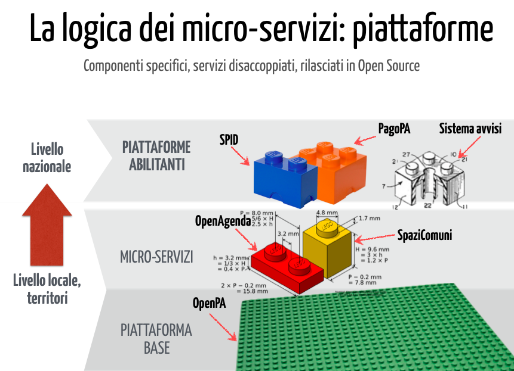

.. _h516a7a2b521825383a3b2b721a727622:

Classi di contenuto per i portali istituzionali
###############################################

.. _h78a33336b592d213d5a132759492a5f:

Verso OntoPiA
#############

.. _h2f65316220271965446c384555203553:

Introduzione
************

.. _h68b1e31577d5212141370806826224:

Le classi di contenuto
======================

I progetti basati sulla tecnologia OpenPA che Opencontent offre agli Enti Pubblici (attualmente: ComunWeb, UpipaWeb, SINET template, ecc...) fanno riferimento ad un modello dati basato su \ |STYLE0|\  (\ |STYLE1|\ ), che di fatto gestiscono in forma strutturata le informazioni dei siti web e dei microservizi (come OpenAgenda); questo approccio offre numerosi vantaggi alle PA, quali:

* una maggior compatibilità con la \ |STYLE2|\ , per la quale è essenziale che il contenuto sia completamente separato dalla forma

* una \ |STYLE3|\  (form web) per l’inserimento dei contenuti, che aiuta i redattore a validare i contenuti ed a gestirli alla fonte secondo un formato \ |STYLE4|\ 

* rendere qualsiasi tipo di dato disponibile via \ |STYLE5|\ , con benefici conseguenti in termini di interoperabilità e generazione di dataset di alta qualità, aggiornati in tempo reale.

\ |IMG1|\ 

Ogni volta che un ente pubblico decide di dotarsi di questa piattaforma, viene generata una nuova istanza dedicata, con un database indipendente; al 31/12/2017, il numero di istanze di OpenPA erano oltre 300 e le richieste di adesione continuano a crescere.

Per garantire che le strutture dati rimangano tra loro allineate nel corso del tempo, è stato predisposto un tool (C&CAF, classes & content alignment framework) che consente di far evolvere le classi di contenuto e al tempo stesso mantenere l’allineamento con le istanze precedentemente attivate.

\ |IMG2|\ 

Più nel dettaglio, quello che succede nella pratica è che durante l’utilizzo quotidiano della piattaforma, un Ente identifica alcune limitazioni nell’utilizzo delle classi disponibili.

In accordo con l’Ente, viene aperta una \ |STYLE6|\ , che comporta l’isolamento dell’istanza dal sistema di allineamento automatico. Vengono quindi predisposte le nuove classi di contenuto e sottoposte ai redattori dell’Ente, quindi via via affinate fino a che danno prova di rispondere alle esigenze e alle aspettative. Una volta collaudata, la modifica viene portata in produzione nel repository centrale che tiene in ordine il modello definitivo, quindi applicata automaticamente a tutte le istanze esistenti.

\ |IMG3|\ 

.. _h7f3d1c4f9676b1d376be7d297f133:

Evoluzione del modello secondo le ontologie di AgID (OntoPiA)
=============================================================

E’ in corso un progressivo allineamento con le ontologie ed i vocabolari controllati definiti da AgID:

\ |LINK1|\ 

Si tratta di un repository di ontologie e vocabolari controllati sviluppati da AgID nell'ambito delle azioni previste dal Piano Triennale per l’Informatica.

I microservizi di \ |LINK2|\  utilizzano le API di questo middleware per:

* mappare i contenuti strutturati gestiti dagli enti pubblici secondo le ontologie definite da AgID

* vincolare l'inserimento dei dati ai vocabolari controllati. Ad esempio, l'interfaccia di inserimento dell'indirizzo di un istituto o luogo della cultura, presente in OpenAgenda, utilizza \ |LINK3|\ .

\ |IMG4|\ 

 

.. bottom of content

.. |STYLE0| replace:: **classi di contenuto**

.. |STYLE1| replace:: *content classes*

.. |STYLE2| replace:: **multi-canalità**

.. |STYLE3| replace:: **guida**

.. |STYLE4| replace:: *machine-readable*

.. |STYLE5| replace:: **API**

.. |STYLE6| replace:: **iniziativa pilota**

.. |LINK1| raw:: html

    <a href="https://github.com/italia/daf-ontologie-vocabolari-controllati" target="_blank">https://github.com/italia/daf-ontologie-vocabolari-controllati</a>

.. |LINK2| raw:: html

    <a href="https://www.opencontent.it/Per-la-PA" target="_blank">OpenPA</a>

.. |LINK3| raw:: html

    <a href="http://ontopa.opencontent.it/api/opendata/v2/content/search/classes%20%5Bclassificazione_del_territorio%5D" target="_blank">questa libreria</a>

.. |IMG1| image:: static/Introduzione_1.png
   :height: 430 px
   :width: 642 px

.. |IMG3| image:: static/Introduzione_3.png
   :height: 500 px
   :width: 642 px

