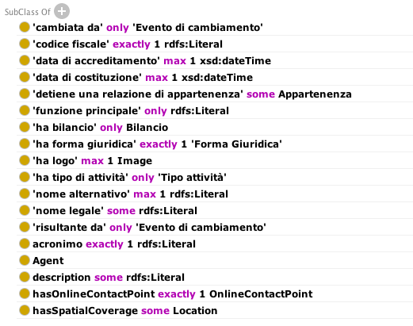
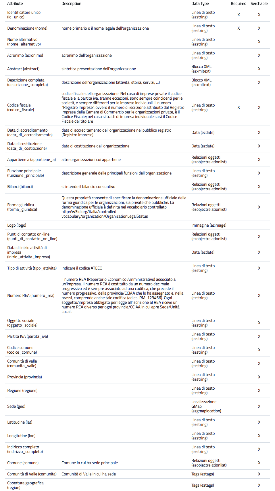
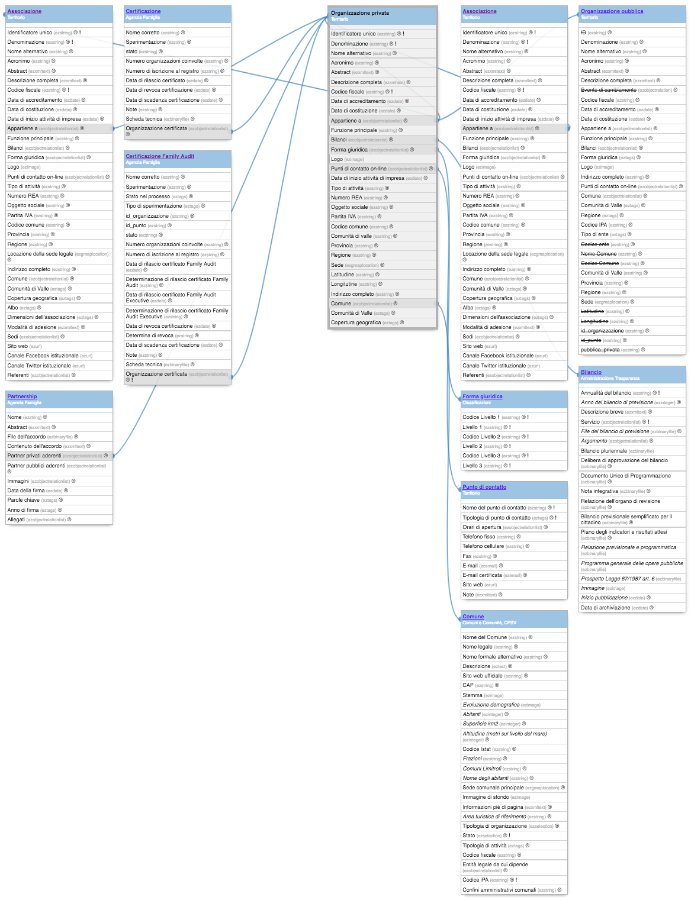

.. _h171b1e7a2f268277a871210216d79:

Organizzazioni (COV-AP_IT)
**************************

Classi di contenuto utilizzate per gestire le organizzazioni.

.. _h7d7047805a12f41454034755c375870:

Organizzazione
==============

\ |STYLE0|\ 

..  Hint:: 

    Al momento non viene utilizzata: risulta  troppo generica per le finalità degli enti.

\ |STYLE1|\ 

Riferimento COV-AP_IT:

\ |LINK1|\ 

Questa è la classe che rappresenta un'organizzazione, sia essa pubblica che privata, tipicamente registrata all'interno di un registro pubblico (e.g., indice della PA per le pubbliche amministrazioni, registro imprese per le organizzazioni private). Esempio "Agenzia per l'Italia Digitale", "Comune di Bologna", "TELECOM ITALIA SPA O TIM S.P.A."

Proprietà previste dal modello:

\ |IMG1|\ 

.. _h2e3046256ea6a70393b2e1295a6328:

Organizzazione pubblica
=======================

\ |STYLE2|\ 

Utilizzata per gestire tutte le organizzazioni pubbliche: comuni, province, regioni, società in house, fondazioni, case di riposo pubbliche (APSP), ASUC, istituti scolastici, ecc..

Identificativo della classe: \ |STYLE3|\ 

Esempio di istanza:

\ |LINK2|\ 

\ |STYLE4|\ 

Questa classe rappresenta un'organizzazione pubblica. Una pubblica amministrazione e qualsiasi altra organizzazione di natura pubblica può essere modellata utilizzando questa classe. In generale,  individui di questa classe sono organizzazioni registrate presso l'Indice della PA (IPA). Questa classe deriva dall'analoga classe del Core Public Organization Vocabulary.

Riferimento COV-AP_IT:

\ |LINK3|\ 

\ |IMG2|\ 

.. _hd2f1d281c5e3953577c551c87a2445:

Organizzazione privata
======================

\ |STYLE5|\ 

Utilizzata per gestire tutte le organizzazioni private, iscritte al registro imprese.

Identificativo della classe: \ |STYLE6|\ 

    <iframe src="http://ontopa.opencontent.it/openpa/classes/private_organization" width="600" height="600">
      
Your browser does not support iframes.

    </iframe>

    <iframe src="http://ontopa.opencontent.it/openpa/relations/private_organization" width="600" height="600">
      
Your browser does not support iframes.

    </iframe>

Esempio di istanza:

\ |LINK4|\ 

Note:

* Punto di contatto è definito da una risorsa esterna: \ |LINK5|\ 

\ |STYLE7|\ 

Questa classe rappresenta un'organizzazione privata ufficialmente registrata presso un registro nazionale (registro imprese).

Riferimento COV-AP_IT:

\ |LINK6|\ 

\ |IMG3|\ 

.. _h4b54463f647b7d435f207f4b3768:

Associazione
============

\ |STYLE8|\ 

Riferimento:

\ |STYLE9|\ 

Vedi organizzazione privata.

.. _h26c59552a54335f271b62d4d1602:

Dipartimento
============

.. _h7d642768304372716448382054487838:

Definizione OpenPA
------------------

[da sistemare]

.. _h3c36461272362165f1619273548a:

Definizione OntoPiA
-------------------

Riferimento COV-AP_IT:

\ |LINK7|\ 

Questa classe rappresenta una generica unità di supporto o unità/divisione dell'organizzazione. Un nome alternativo potrebbe essere anche Dipartimento. Essa, nel contesto italiano, si suddivide in due tipologie di unità di supporto: Area Organizzativa Omogena e Ufficio (unità organizzativa). Questa è una classe astratta istanziata nei dati con i due precedenti tipi.

\ |IMG4|\ 

.. _h22144ff6774f2e297f35665964214:

Area
====

.. _h7d642768304372716448382054487838:

Definizione OpenPA
------------------

.. _h3c36461272362165f1619273548a:

Definizione OntoPiA
-------------------

Riferimento COV-AP_IT:

\ |LINK8|\ 

Questa classe rappresenta una generica unità di supporto o unità/divisione dell'organizzazione. Un nome alternativo potrebbe essere anche Dipartimento. Essa, nel contesto italiano, si suddivide in due tipologie di unità di supporto: Area Organizzativa Omogena e Ufficio (unità organizzativa). Questa è una classe astratta istanziata nei dati con i due precedenti tipi.

.. _h442a7c272a6a7f676c5b5b40362e1921:

Servizio (struttura organizzativa)
==================================

.. _h7d642768304372716448382054487838:

Definizione OpenPA
------------------

.. _h3c36461272362165f1619273548a:

Definizione OntoPiA
-------------------

Riferimento COV-AP_IT:

\ |LINK9|\ 

Questa classe rappresenta una generica unità di supporto o unità/divisione dell'organizzazione. Un nome alternativo potrebbe essere anche Dipartimento. Essa, nel contesto italiano, si suddivide in due tipologie di unità di supporto: Area Organizzativa Omogena e Ufficio (unità organizzativa). Questa è una classe astratta istanziata nei dati con i due precedenti tipi.

.. _h2b206633b2c16212727423e14463c3d:

Ufficio
=======

.. _h7d642768304372716448382054487838:

Definizione OpenPA
------------------

.. _h3c36461272362165f1619273548a:

Definizione OntoPiA
-------------------

Riferimento COV-AP_IT:

\ |LINK10|\ 

Questa classe rappresenta una generica unità di supporto o unità/divisione dell'organizzazione. Un nome alternativo potrebbe essere anche Dipartimento. Essa, nel contesto italiano, si suddivide in due tipologie di unità di supporto: Area Organizzativa Omogena e Ufficio (unità organizzativa). Questa è una classe astratta istanziata nei dati con i due precedenti tipi.

\ |IMG5|\ 

.. bottom of content

.. |STYLE0| replace:: **Definizione OpenPA**

.. |STYLE1| replace:: **Definizione OntoPiA**

.. |STYLE2| replace:: **Definizione OpenPA**

.. |STYLE3| replace:: *public_organization*

.. |STYLE4| replace:: **Definizione OntoPiA**

.. |STYLE5| replace:: **Definizione OpenPA**

.. |STYLE6| replace:: *private_organization*

.. |STYLE7| replace:: **Definizione OntoPiA**

.. |STYLE8| replace:: **Definizione OpenPA**

.. |STYLE9| replace:: **Definizione OntoPiA**

.. |LINK1| raw:: html

    <a href="https://github.com/italia/daf-ontologie-vocabolari-controllati/tree/master/Ontologie/COV/v0.10" target="_blank">https://github.com/italia/daf-ontologie-vocabolari-controllati/tree/master/Ontologie/COV/v0.10</a>

.. |LINK2| raw:: html

    <a href="https://www.trentinofamiglia.it/openpa/classes/public_organization" target="_blank">https://www.trentinofamiglia.it/openpa/classes/public_organization</a>

.. |LINK3| raw:: html

    <a href="https://github.com/italia/daf-ontologie-vocabolari-controllati/tree/master/Ontologie/COV/v0.10" target="_blank">https://github.com/italia/daf-ontologie-vocabolari-controllati/tree/master/Ontologie/COV/v0.10</a>

.. |LINK4| raw:: html

    <a href="https://www.trentinofamiglia.it/openpa/classes/private_organization" target="_blank">https://www.trentinofamiglia.it/openpa/classes/private_organization</a>

.. |LINK5| raw:: html

    <a href="https://github.com/italia/daf-ontologie-vocabolari-controllati/blob/master/Ontologie/COV/v0.10/COV-AP_IT.rdf#L1779" target="_blank">https://github.com/italia/daf-ontologie-vocabolari-controllati/blob/master/Ontologie/COV/v0.10/COV-AP_IT.rdf#L1779</a>

.. |LINK6| raw:: html

    <a href="https://github.com/italia/daf-ontologie-vocabolari-controllati/tree/master/Ontologie/COV/v0.10" target="_blank">https://github.com/italia/daf-ontologie-vocabolari-controllati/tree/master/Ontologie/COV/v0.10</a>

.. |LINK7| raw:: html

    <a href="https://github.com/italia/daf-ontologie-vocabolari-controllati/tree/master/Ontologie/COV/v0.10" target="_blank">https://github.com/italia/daf-ontologie-vocabolari-controllati/tree/master/Ontologie/COV/v0.10</a>

.. |LINK8| raw:: html

    <a href="https://github.com/italia/daf-ontologie-vocabolari-controllati/tree/master/Ontologie/COV/v0.10" target="_blank">https://github.com/italia/daf-ontologie-vocabolari-controllati/tree/master/Ontologie/COV/v0.10</a>

.. |LINK9| raw:: html

    <a href="https://github.com/italia/daf-ontologie-vocabolari-controllati/tree/master/Ontologie/COV/v0.10" target="_blank">https://github.com/italia/daf-ontologie-vocabolari-controllati/tree/master/Ontologie/COV/v0.10</a>

.. |LINK10| raw:: html

    <a href="https://github.com/italia/daf-ontologie-vocabolari-controllati/tree/master/Ontologie/COV/v0.10" target="_blank">https://github.com/italia/daf-ontologie-vocabolari-controllati/tree/master/Ontologie/COV/v0.10</a>

