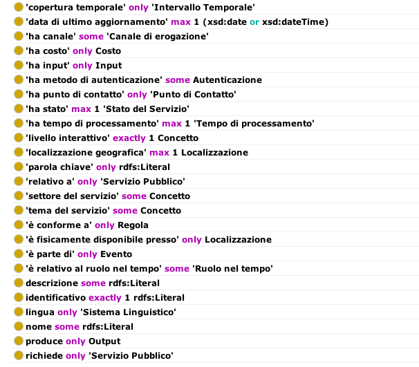

.. _h228122259146a61351677d351a204b:

Servizi pubblici (CPSV-AP_IT)
*****************************

Classe: \ |STYLE0|\ 

Identificativo della classe: \ |STYLE1|\ 

Riferimento a OntoPiA:

\ |LINK1|\ 

Descrizione della classe:

+-------------+---------------------------------------------------------------------------------------------------------------------------------------------------------------------------------------------------------------------------------------------------------------------------------------------------------------------------------------------------------------------------------------------------------------------------------------------------------------+----------------------------------------+------------+
|\ |STYLE2|\  |\ |STYLE3|\                                                                                                                                                                                                                                                                                                                                                                                                                                                    |\ |STYLE4|\                             |\ |STYLE5|\ |
+-------------+---------------------------------------------------------------------------------------------------------------------------------------------------------------------------------------------------------------------------------------------------------------------------------------------------------------------------------------------------------------------------------------------------------------------------------------------------------------+----------------------------------------+------------+
|\ |STYLE6|\  |Indicare il nome del servizio evitando acronimi, riferimenti normativi o codici non esaustivi, es. "Dichiarazione precompilata"                                                                                                                                                                                                                                                                                                                                |Linea di testo (ezstring)               |X           |
+-------------+---------------------------------------------------------------------------------------------------------------------------------------------------------------------------------------------------------------------------------------------------------------------------------------------------------------------------------------------------------------------------------------------------------------------------------------------------------------+----------------------------------------+------------+
|\ |STYLE7|\  |È possibile indicare un nome alternativo del servizio. Se questo campo è compilato verrà visualizzato al posto del "nome del servizio" indicato nel campo precedente                                                                                                                                                                                                                                                                                           |Linea di testo (ezstring)               |            |
+-------------+---------------------------------------------------------------------------------------------------------------------------------------------------------------------------------------------------------------------------------------------------------------------------------------------------------------------------------------------------------------------------------------------------------------------------------------------------------------+----------------------------------------+------------+
|\ |STYLE8|\  |Indicare una sintetica descrizione del servizio utilizzando un linguaggio semplice che possa aiutare qualsiasi utente a identificare il servizio. Non utilizzare un linguaggio ricco di riferimenti normativi. Gli indirizzi web e le e-mail vengono trasformati in link automaticamente                                                                                                                                                                       |Blocco XML (ezxmltext)                  |X           |
+-------------+---------------------------------------------------------------------------------------------------------------------------------------------------------------------------------------------------------------------------------------------------------------------------------------------------------------------------------------------------------------------------------------------------------------------------------------------------------------+----------------------------------------+------------+
|\ |STYLE9|\  |Indicare la descrizione completa del servizio utilizzando un linguaggio semplice che possa aiutare qualsiasi utente a identificare il servizio. Non utilizzare un linguaggio ricco di riferimenti normativi. E' consentito caricare una formattazione anche complessa dei testi, corredata da immagini, file allegati, tabelle, ecc.... Gli indirizzi web e le e-mail vengono trasformati in link automaticamente                                              |Blocco XML (ezxmltext)                  |            |
+-------------+---------------------------------------------------------------------------------------------------------------------------------------------------------------------------------------------------------------------------------------------------------------------------------------------------------------------------------------------------------------------------------------------------------------------------------------------------------------+----------------------------------------+------------+
|\ |STYLE10|\ |È possibile indicare dei codici associati al servizio, come codici gestionali o idenfificativi usati in database interni all'organizzazione.                                                                                                                                                                                                                                                                                                                   |Linea di testo (ezstring)               |            |
+-------------+---------------------------------------------------------------------------------------------------------------------------------------------------------------------------------------------------------------------------------------------------------------------------------------------------------------------------------------------------------------------------------------------------------------------------------------------------------------+----------------------------------------+------------+
|\ |STYLE11|\ |                                                                                                                                                                                                                                                                                                                                                                                                                                                               |Blocco XML (ezxmltext)                  |            |
+-------------+---------------------------------------------------------------------------------------------------------------------------------------------------------------------------------------------------------------------------------------------------------------------------------------------------------------------------------------------------------------------------------------------------------------------------------------------------------------+----------------------------------------+------------+
|\ |STYLE12|\ |                                                                                                                                                                                                                                                                                                                                                                                                                                                               |Tags (eztags)                           |            |
+-------------+---------------------------------------------------------------------------------------------------------------------------------------------------------------------------------------------------------------------------------------------------------------------------------------------------------------------------------------------------------------------------------------------------------------------------------------------------------------+----------------------------------------+------------+
|\ |STYLE13|\ |descrivere come l'utente deve usare la modulistica, a chi inviarla, attraverso quale canale, in che tempi, ecc...                                                                                                                                                                                                                                                                                                                                              |Blocco XML (ezxmltext)                  |X           |
+-------------+---------------------------------------------------------------------------------------------------------------------------------------------------------------------------------------------------------------------------------------------------------------------------------------------------------------------------------------------------------------------------------------------------------------------------------------------------------------+----------------------------------------+------------+
|\ |STYLE14|\ |Indicare uno o più input richiesti dal servizio. L’input può essere qualsiasi risorsa (documenti, moduli, codici, ecc…) necessaria affinché il servizio sia espletato. Es.: "numero di targa", "codice fiscale"                                                                                                                                                                                                                                                |Relazioni oggetti (ezobjectrelationlist)|            |
+-------------+---------------------------------------------------------------------------------------------------------------------------------------------------------------------------------------------------------------------------------------------------------------------------------------------------------------------------------------------------------------------------------------------------------------------------------------------------------------+----------------------------------------+------------+
|\ |STYLE15|\ |indicare il numero massimo di giorni entro i quali il servizio viene erogato                                                                                                                                                                                                                                                                                                                                                                                   |Intero (ezinteger)                      |            |
+-------------+---------------------------------------------------------------------------------------------------------------------------------------------------------------------------------------------------------------------------------------------------------------------------------------------------------------------------------------------------------------------------------------------------------------------------------------------------------------+----------------------------------------+------------+
|\ |STYLE16|\ |Indicare uno o più output prodotti dal servizio. Es: "certificato di residenza"                                                                                                                                                                                                                                                                                                                                                                                |Relazioni oggetti (ezobjectrelationlist)|            |
+-------------+---------------------------------------------------------------------------------------------------------------------------------------------------------------------------------------------------------------------------------------------------------------------------------------------------------------------------------------------------------------------------------------------------------------------------------------------------------------+----------------------------------------+------------+
|\ |STYLE17|\ |Inserire un riferimento stabile per il servizio, indicando gli uffici responsabili della raccolta delle richieste/commenti relativi al servizio e della predisposizione delle relative risposte. Qualora il dato esista è obbligatorio il nome e l'email. Solo se non è possibile individuare il riferimento dell’ufficio, si può indicare l’organizzazione nel suo complesso. Evitare di inserire riferimenti email, telefono o nominativi di persone singole.|Relazioni oggetti (ezobjectrelationlist)|            |
+-------------+---------------------------------------------------------------------------------------------------------------------------------------------------------------------------------------------------------------------------------------------------------------------------------------------------------------------------------------------------------------------------------------------------------------------------------------------------------------+----------------------------------------+------------+
|\ |STYLE18|\ |Indicare uno o più periodi temporali associati al servizio. Se esiste una copertura temporale specificare almeno la data di inizio dei periodi temporali. es. Dal 22 gennaio al 22 febbraio 2017 si aprono le Iscrizioni alle scuole online.                                                                                                                                                                                                                   |Relazioni oggetti (ezobjectrelationlist)|            |
+-------------+---------------------------------------------------------------------------------------------------------------------------------------------------------------------------------------------------------------------------------------------------------------------------------------------------------------------------------------------------------------------------------------------------------------------------------------------------------------+----------------------------------------+------------+
|\ |STYLE19|\ |Indicare se il servizio ha una copertura geografica, ossia, si riferisce a un determinato territorio                                                                                                                                                                                                                                                                                                                                                           |Tags (eztags)                           |            |
+-------------+---------------------------------------------------------------------------------------------------------------------------------------------------------------------------------------------------------------------------------------------------------------------------------------------------------------------------------------------------------------------------------------------------------------------------------------------------------------+----------------------------------------+------------+
|\ |STYLE20|\ |Lo stato del servizio indica l'effettiva fruibilità del servizio                                                                                                                                                                                                                                                                                                                                                                                               |Tags (eztags)                           |X           |
+-------------+---------------------------------------------------------------------------------------------------------------------------------------------------------------------------------------------------------------------------------------------------------------------------------------------------------------------------------------------------------------------------------------------------------------------------------------------------------------+----------------------------------------+------------+
|\ |STYLE21|\ |Regolamenti relativi al servizio erogato                                                                                                                                                                                                                                                                                                                                                                                                                       |Relazioni oggetti (ezobjectrelationlist)|            |
+-------------+---------------------------------------------------------------------------------------------------------------------------------------------------------------------------------------------------------------------------------------------------------------------------------------------------------------------------------------------------------------------------------------------------------------------------------------------------------------+----------------------------------------+------------+
|\ |STYLE22|\ |Normative che regolamentano il servizio                                                                                                                                                                                                                                                                                                                                                                                                                        |Relazioni oggetti (ezobjectrelationlist)|            |
+-------------+---------------------------------------------------------------------------------------------------------------------------------------------------------------------------------------------------------------------------------------------------------------------------------------------------------------------------------------------------------------------------------------------------------------------------------------------------------------+----------------------------------------+------------+
|\ |STYLE23|\ |Selezionare uno o più temi a cui il servizio può essere riferito                                                                                                                                                                                                                                                                                                                                                                                               |Tags (eztags)                           |            |
+-------------+---------------------------------------------------------------------------------------------------------------------------------------------------------------------------------------------------------------------------------------------------------------------------------------------------------------------------------------------------------------------------------------------------------------------------------------------------------------+----------------------------------------+------------+
|\ |STYLE24|\ |Selezionare uno o più settori (o sotto temi) di riferimento. La classificazione è NACE (classificazione delle attività economiche della Comunità Europea).                                                                                                                                                                                                                                                                                                     |Tags (eztags)                           |            |
+-------------+---------------------------------------------------------------------------------------------------------------------------------------------------------------------------------------------------------------------------------------------------------------------------------------------------------------------------------------------------------------------------------------------------------------------------------------------------------------+----------------------------------------+------------+
|\ |STYLE25|\ |                                                                                                                                                                                                                                                                                                                                                                                                                                                               |Tags (eztags)                           |            |
+-------------+---------------------------------------------------------------------------------------------------------------------------------------------------------------------------------------------------------------------------------------------------------------------------------------------------------------------------------------------------------------------------------------------------------------------------------------------------------------+----------------------------------------+------------+
|\ |STYLE26|\ |Indicare una o più parole chiave, separate da virgola. Sono utili per agevolare la ricerca nel catalogo. es: residenza, anagrafe, cittadinanza.                                                                                                                                                                                                                                                                                                                |Tags (eztags)                           |            |
+-------------+---------------------------------------------------------------------------------------------------------------------------------------------------------------------------------------------------------------------------------------------------------------------------------------------------------------------------------------------------------------------------------------------------------------------------------------------------------------+----------------------------------------+------------+
|\ |STYLE27|\ |Indicare, se previste, le modalità di autenticazione necessarie per accedere al servizio                                                                                                                                                                                                                                                                                                                                                                       |Tags (eztags)                           |            |
+-------------+---------------------------------------------------------------------------------------------------------------------------------------------------------------------------------------------------------------------------------------------------------------------------------------------------------------------------------------------------------------------------------------------------------------------------------------------------------------+----------------------------------------+------------+
|\ |STYLE28|\ |Per maggiori informazioni, consulta : http://qualitapa.gov.it/relazioni-con-i-cittadini/open-government/comunicazione-istituzionale-on-line/i-livelli-di-interazione-dei-servizi-on-line/                                                                                                                                                                                                                                                                      |Tags (eztags)                           |            |
+-------------+---------------------------------------------------------------------------------------------------------------------------------------------------------------------------------------------------------------------------------------------------------------------------------------------------------------------------------------------------------------------------------------------------------------------------------------------------------------+----------------------------------------+------------+
|\ |STYLE29|\ |indicare i canali telematici a cui inoltrare la richiesta                                                                                                                                                                                                                                                                                                                                                                                                      |Relazioni oggetti (ezobjectrelationlist)|            |
+-------------+---------------------------------------------------------------------------------------------------------------------------------------------------------------------------------------------------------------------------------------------------------------------------------------------------------------------------------------------------------------------------------------------------------------------------------------------------------------+----------------------------------------+------------+
|\ |STYLE30|\ |Indicare una o più lingue attraverso cui il servizio è erogato.                                                                                                                                                                                                                                                                                                                                                                                                |Tags (eztags)                           |            |
+-------------+---------------------------------------------------------------------------------------------------------------------------------------------------------------------------------------------------------------------------------------------------------------------------------------------------------------------------------------------------------------------------------------------------------------------------------------------------------------+----------------------------------------+------------+
|\ |STYLE31|\ |Indicare, se previsto, il costo del servizio.                                                                                                                                                                                                                                                                                                                                                                                                                  |Relazioni oggetti (ezobjectrelationlist)|            |
+-------------+---------------------------------------------------------------------------------------------------------------------------------------------------------------------------------------------------------------------------------------------------------------------------------------------------------------------------------------------------------------------------------------------------------------------------------------------------------------+----------------------------------------+------------+
|\ |STYLE32|\ |                                                                                                                                                                                                                                                                                                                                                                                                                                                               |Blocco XML (ezxmltext)                  |            |
+-------------+---------------------------------------------------------------------------------------------------------------------------------------------------------------------------------------------------------------------------------------------------------------------------------------------------------------------------------------------------------------------------------------------------------------------------------------------------------------+----------------------------------------+------------+
|\ |STYLE33|\ |Luogo fisico in cui viene erogato il servizio                                                                                                                                                                                                                                                                                                                                                                                                                  |Relazioni oggetti (ezobjectrelationlist)|            |
+-------------+---------------------------------------------------------------------------------------------------------------------------------------------------------------------------------------------------------------------------------------------------------------------------------------------------------------------------------------------------------------------------------------------------------------------------------------------------------------+----------------------------------------+------------+
|\ |STYLE34|\ |                                                                                                                                                                                                                                                                                                                                                                                                                                                               |Relazioni oggetti (ezobjectrelationlist)|            |
+-------------+---------------------------------------------------------------------------------------------------------------------------------------------------------------------------------------------------------------------------------------------------------------------------------------------------------------------------------------------------------------------------------------------------------------------------------------------------------------+----------------------------------------+------------+
|\ |STYLE35|\ |                                                                                                                                                                                                                                                                                                                                                                                                                                                               |Relazioni oggetti (ezobjectrelationlist)|            |
+-------------+---------------------------------------------------------------------------------------------------------------------------------------------------------------------------------------------------------------------------------------------------------------------------------------------------------------------------------------------------------------------------------------------------------------------------------------------------------------+----------------------------------------+------------+
|\ |STYLE36|\ |                                                                                                                                                                                                                                                                                                                                                                                                                                                               |Immagine (ezimage)                      |            |
+-------------+---------------------------------------------------------------------------------------------------------------------------------------------------------------------------------------------------------------------------------------------------------------------------------------------------------------------------------------------------------------------------------------------------------------------------------------------------------------+----------------------------------------+------------+
|\ |STYLE37|\ |Specificare il nome dell'organizzazione, come indicato nell'Indice della Pubblica Amministrazione (IPA), che esercita uno specifico ruolo sul servizio                                                                                                                                                                                                                                                                                                         |Linea di testo (ezstring)               |X           |
+-------------+---------------------------------------------------------------------------------------------------------------------------------------------------------------------------------------------------------------------------------------------------------------------------------------------------------------------------------------------------------------------------------------------------------------------------------------------------------------+----------------------------------------+------------+
|\ |STYLE38|\ |                                                                                                                                                                                                                                                                                                                                                                                                                                                               |Checkbox (ezboolean)                    |            |
+-------------+---------------------------------------------------------------------------------------------------------------------------------------------------------------------------------------------------------------------------------------------------------------------------------------------------------------------------------------------------------------------------------------------------------------------------------------------------------------+----------------------------------------+------------+
|\ |STYLE39|\ |                                                                                                                                                                                                                                                                                                                                                                                                                                                               |Selezione (ezselection)                 |            |
+-------------+---------------------------------------------------------------------------------------------------------------------------------------------------------------------------------------------------------------------------------------------------------------------------------------------------------------------------------------------------------------------------------------------------------------------------------------------------------------+----------------------------------------+------------+

Integrazione rispetto al modello CPSV-AP_IT:

* \ |STYLE40|\ : va predisposto un vocabolario controllato per definire i target utenti (ad esempio: famiglia, adulto, studente, ecc..)

Schema delle relazioni 

\ |IMG1|\ 

.. bottom of content

.. |STYLE0| replace:: **Servizio pubblico**

.. |STYLE1| replace:: *public_service*

.. |STYLE2| replace:: **Proprietà**

.. |STYLE3| replace:: **Descrizione**

.. |STYLE4| replace:: **Datatype**

.. |STYLE5| replace:: **Obbl.**

.. |STYLE6| replace:: **Nome del servizio (name)**

.. |STYLE7| replace:: **Nome alternativo (nome_alternativo)**

.. |STYLE8| replace:: **Abstract (intro)**

.. |STYLE9| replace:: **Descrizione completa (description)**

.. |STYLE10| replace:: **Identificativo (identifier)**

.. |STYLE11| replace:: **Chi può fare domanda (chi_puo_fare_domanda)**

.. |STYLE12| replace:: **Aventi diritto (target)**

.. |STYLE13| replace:: **Come aderire (come_aderire)**

.. |STYLE14| replace:: **Input richiesti (input)**

.. |STYLE15| replace:: **Giorni di attesa, dalla richiesta (giorni_di_attesa_dalla_richiesta)**

.. |STYLE16| replace:: **Output prodotti (output)**

.. |STYLE17| replace:: **Punti di contatto (contact_point)**

.. |STYLE18| replace:: **Copertura temporale (copertura_temporale)**

.. |STYLE19| replace:: **Copertura geografica (copertura_geografica)**

.. |STYLE20| replace:: **Stato (stato)**

.. |STYLE21| replace:: **Regolamenti o disciplinari (rule)**

.. |STYLE22| replace:: **Normative (normativa)**

.. |STYLE23| replace:: **Temi (themes)**

.. |STYLE24| replace:: **Settori (sectors)**

.. |STYLE25| replace:: **Argomenti (argomenti)**

.. |STYLE26| replace:: **Parole chiave (keywords)**

.. |STYLE27| replace:: **Autenticazione (authentication)**

.. |STYLE28| replace:: **Livello interazione (interaction)**

.. |STYLE29| replace:: **Canali telematici a cui inoltrare la domanda (channels)**

.. |STYLE30| replace:: **Lingua (language)**

.. |STYLE31| replace:: **Costo (cost)**

.. |STYLE32| replace:: **Note relative ai costi (note_costi)**

.. |STYLE33| replace:: **Disponibile presso (location)**

.. |STYLE34| replace:: **Servizio correlato (servizio_correlato)**

.. |STYLE35| replace:: **Servizio richiesto (servizio_richiesto)**

.. |STYLE36| replace:: **Immagine (image)**

.. |STYLE37| replace:: **Codice dell'Ente erogatore (ipa)**

.. |STYLE38| replace:: **Mostra figli (show_children)**

.. |STYLE39| replace:: **Visualizzazione dei figli (children_view)**

.. |STYLE40| replace:: **Aventi diritto**

.. |LINK1| raw:: html

    <a href="https://github.com/italia/daf-semantics/tree/master/semantic_manager/dist/data/ontologies/agid/CPSV-AP_IT" target="_blank">https://github.com/italia/daf-semantics/tree/master/semantic_manager/dist/data/ontologies/agid/CPSV-AP_IT</a>

