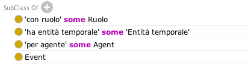
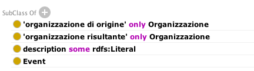
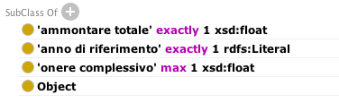

.. _h34383f4c7566383136851593436563:

Verso OntoPiA - Classi di contenuto
###################################

.. _h2f65316220271965446c384555203553:

Introduzione
************

.. _h68b1e31577d5212141370806826224:

Le classi di contenuto
======================

I progetti basati sulla tecnologia OpenPA che Opencontent offre agli Enti Pubblici (attualmente: ComunWeb, UpipaWeb, SINET template, ecc...) fanno riferimento ad un modello dati basato su \ |STYLE0|\  (\ |STYLE1|\ ), che di fatto gestiscono in forma strutturata le informazioni dei siti web e dei microservizi (come OpenAgenda); questo approccio offre numerosi vantaggi alle PA, quali:

* una maggior compatibilità con la \ |STYLE2|\ , per la quale è essenziale che il contenuto sia completamente separato dalla forma

* una \ |STYLE3|\  (form web) per l’inserimento dei contenuti, che aiuta i redattore a validare i contenuti ed a gestirli alla fonte secondo un formato \ |STYLE4|\ 

* rendere qualsiasi tipo di dato disponibile via \ |STYLE5|\ , con benefici conseguenti in termini di interoperabilità e generazione di dataset di alta qualità, aggiornati in tempo reale.

\ |IMG1|\ 

Ogni volta che un ente pubblico decide di dotarsi di questa piattaforma, viene generata una nuova istanza dedicata, con un database indipendente; al 31/12/2017, il numero di istanze di OpenPA erano oltre 300 e le richieste di adesione continuano a crescere.

Per garantire che le strutture dati rimangano tra loro allineate nel corso del tempo, è stato predisposto un tool (C&CAF, classes & content alignment framework) che consente di far evolvere le classi di contenuto e al tempo stesso mantenere l’allineamento con le istanze precedentemente attivate.

\ |IMG2|\ 

Più nel dettaglio, quello che succede nella pratica è che durante l’utilizzo quotidiano della piattaforma, un Ente identifica alcune limitazioni nell’utilizzo delle classi disponibili.

In accordo con l’Ente, viene aperta una \ |STYLE6|\ , che comporta l’isolamento dell’istanza dal sistema di allineamento automatico. Vengono quindi predisposte le nuove classi di contenuto e sottoposte ai redattori dell’Ente, quindi via via affinate fino a che danno prova di rispondere alle esigenze e alle aspettative. Una volta collaudata, la modifica viene portata in produzione nel repository centrale che tiene in ordine il modello definitivo, quindi applicata automaticamente a tutte le istanze esistenti.

\ |IMG3|\ 

.. _h7f3d1c4f9676b1d376be7d297f133:

Evoluzione del modello secondo le ontologie di AgID (OntoPiA)
=============================================================

E’ in corso un progressivo allineamento con le ontologie ed i vocabolari controllati definiti da AgID:

\ |LINK1|\ 

Si tratta di un repository di ontologie e vocabolari controllati sviluppati da AgID nell'ambito delle azioni previste dal Piano Triennale per l’Informatica.

I microservizi di \ |LINK2|\  utilizzano le API di questo middleware per:

* mappare i contenuti strutturati gestiti dagli enti pubblici secondo le ontologie definite da AgID

* vincolare l'inserimento dei dati ai vocabolari controllati. Ad esempio, l'interfaccia di inserimento dell'indirizzo di un istituto o luogo della cultura, presente in OpenAgenda, utilizza \ |LINK3|\ .

\ |IMG4|\ 

 

.. _h2c1d74277104e41780968148427e:

.. _h2878256a793dd584a14e7776663c4a:

Classi di contenuto
*******************

.. _h7d7047805a12f41454034755c375870:

Organizzazione
==============

.. _h7d642768304372716448382054487838:

Definizione OpenPA
------------------

Al momento non viene utilizzata in OntoPA: risulta  troppo generica per le finalità degli enti.

.. _h3c36461272362165f1619273548a:

Definizione OntoPiA
-------------------

Riferimento COV-AP_IT:

\ |LINK4|\ 

Questa è la classe che rappresenta un'organizzazione, sia essa pubblica che privata, tipicamente registrata all'interno di un registro pubblico (e.g., indice della PA per le pubbliche amministrazioni, registro imprese per le organizzazioni private). Esempio "Agenzia per l'Italia Digitale", "Comune di Bologna", "TELECOM ITALIA SPA O TIM S.P.A."

\ |IMG5|\ 

.. _h2e3046256ea6a70393b2e1295a6328:

Organizzazione pubblica
=======================

.. _h7d642768304372716448382054487838:

Definizione OpenPA
------------------

Riferimento:

https://www.trentinofamiglia.it/openpa/classes/public_organization

.. _h3c36461272362165f1619273548a:

Definizione OntoPiA
-------------------

Riferimento COV-AP_IT:

\ |LINK5|\ 

Questa classe rappresenta un'organizzazione pubblica. Una pubblica amministrazione e qualsiasi altra organizzazione di natura pubblica può essere modellata utilizzando questa classe. In generale,  individui di questa classe sono organizzazioni registrate presso l'Indice della PA (IPA). Questa classe deriva dall'analoga classe del Core Public Organization Vocabulary.

\ |IMG6|\ 

.. _hd2f1d281c5e3953577c551c87a2445:

Organizzazione privata
======================

.. _h7d642768304372716448382054487838:

Definizione OpenPA
------------------

Riferimento:

\ |LINK6|\ 

Note:

* Punto di contatto è definito da una risorsa esterna: \ |LINK7|\ 

.. _h3c36461272362165f1619273548a:

Definizione OntoPiA
-------------------

Riferimento COV-AP_IT:

\ |LINK8|\ 

Questa classe rappresenta un'organizzazione privata ufficialmente registrata presso un registro nazionale (registro imprese).

\ |IMG7|\ 

.. _h4b54463f647b7d435f207f4b3768:

Associazione
============

.. _h7d642768304372716448382054487838:

Definizione OpenPA
------------------

Riferimento:

.. _h3c36461272362165f1619273548a:

Definizione OntoPiA
-------------------

Vedi organizzazione privata.

.. _h3c384e643f47203b3a2c3a7735401a72:

Ruolo nel tempo
===============

.. _h7d642768304372716448382054487838:

Definizione OpenPA
------------------

Mancante, da fare

.. _h3c36461272362165f1619273548a:

Definizione OntoPiA
-------------------

Riferimento COV-AP_IT:

\ |LINK9|\ 

Rappresentazione di un ruolo associato ad un intervallo temporale determinato.

\ |IMG8|\ 

.. _h6f56334e2b194b6b9292496971203:

Ruolo
=====

.. _h7d642768304372716448382054487838:

Definizione OpenPA
------------------

Da rivedere… di fatto non ancora usato

.. _h3c36461272362165f1619273548a:

Definizione OntoPiA
-------------------

Riferimento COV-AP_IT:

\ |LINK10|\ 

Questa classe è definita in http://dati.gov.it/onto/roapit/ e, in questa ontologia, rappresenta il ruolo nella relazione ennaria con l'Agente, l'Organizzazione, e la situazione di Appartenenza. Essa è utilizzata per modellare il Ruolo di un membro dell'organizzazione in un certo intervallo temporale.

\ |IMG9|\ 

.. _h62115463455271f543ce6c483f305d:

Appartenenza
============

.. _h7d642768304372716448382054487838:

Definizione OpenPA
------------------

Mancante, da fare

.. _h3c36461272362165f1619273548a:

Definizione OntoPiA
-------------------

Riferimento COV-AP_IT:

\ |LINK11|\ 

Questa classe rappresenta la natura di appartenenza di un agente di un'organizzazione. In particolare, la classe è una relazione ennaria che rappresenta una situazione che coinvolge un agente, un'organizzazione, i l ruolo che l'agente ricopre nell'organizzazione ed eventualmente il lasso temporale in cui quel ruolo è svolto. Esempio: la classe consente di rappresentare il ruolo di amministratore delegato  di un'impresa in un certo lasso temporale oppure il ruolo di consigliere in una società partecipata di una pubblica amministrazione in un certo intervallo temporale.

\ |IMG10|\ 

.. _h795f2c3a64d6b45f1b72746e4f4880:

Evento di cambiamento
=====================

.. _h7d642768304372716448382054487838:

Definizione OpenPA
------------------

Mancante, da fare

.. _h6765729b4c61241e217220a47456c:

Problema da risolvere
---------------------

Le organizzazioni private di Trentino Famiglia cambiano nome nel corso del tempo; come gestire questo cambiamento?

.. _h3c36461272362165f1619273548a:

Definizione OntoPiA
-------------------

Riferimento COV-AP_IT:

\ |LINK12|\ 

Organizzazioni sono formate o cambiano in risposta ad eventi. Questo potrebbe essere il risultato di nuove normative, di nuove obbligazioni, di riassetti ecc. Questa classe mira a catturare questi tipi di eventi di cambiamento nell'organizzazione. In particolare, al momento si sono individuati i seguenti tipi di eventi: Fondazione, Chiusura, Fusione, Scissione, Sostituzione. La semantica di questa classe è la stessa di quella fornita nell'ambito del vocabolario europeo Core Public Organization Vocabulary.

\ |IMG11|\ 

.. _h26c59552a54335f271b62d4d1602:

Dipartimento
============

.. _h7d642768304372716448382054487838:

Definizione OpenPA
------------------

[da sistemare]

.. _h3c36461272362165f1619273548a:

Definizione OntoPiA
-------------------

Riferimento COV-AP_IT:

\ |LINK13|\ 

Questa classe rappresenta una generica unità di supporto o unità/divisione dell'organizzazione. Un nome alternativo potrebbe essere anche Dipartimento. Essa, nel contesto italiano, si suddivide in due tipologie di unità di supporto: Area Organizzativa Omogena e Ufficio (unità organizzativa). Questa è una classe astratta istanziata nei dati con i due precedenti tipi.

\ |IMG12|\ 

.. _h22144ff6774f2e297f35665964214:

Area
====

.. _h7d642768304372716448382054487838:

Definizione OpenPA
------------------

.. _h3c36461272362165f1619273548a:

Definizione OntoPiA
-------------------

Riferimento COV-AP_IT:

\ |LINK14|\ 

Questa classe rappresenta una generica unità di supporto o unità/divisione dell'organizzazione. Un nome alternativo potrebbe essere anche Dipartimento. Essa, nel contesto italiano, si suddivide in due tipologie di unità di supporto: Area Organizzativa Omogena e Ufficio (unità organizzativa). Questa è una classe astratta istanziata nei dati con i due precedenti tipi.

.. _h442a7c272a6a7f676c5b5b40362e1921:

Servizio (struttura organizzativa)
==================================

.. _h7d642768304372716448382054487838:

Definizione OpenPA
------------------

.. _h3c36461272362165f1619273548a:

Definizione OntoPiA
-------------------

Riferimento COV-AP_IT:

\ |LINK15|\ 

Questa classe rappresenta una generica unità di supporto o unità/divisione dell'organizzazione. Un nome alternativo potrebbe essere anche Dipartimento. Essa, nel contesto italiano, si suddivide in due tipologie di unità di supporto: Area Organizzativa Omogena e Ufficio (unità organizzativa). Questa è una classe astratta istanziata nei dati con i due precedenti tipi.

.. _h2b206633b2c16212727423e14463c3d:

Ufficio
=======

.. _h7d642768304372716448382054487838:

Definizione OpenPA
------------------

.. _h3c36461272362165f1619273548a:

Definizione OntoPiA
-------------------

Riferimento COV-AP_IT:

\ |LINK16|\ 

Questa classe rappresenta una generica unità di supporto o unità/divisione dell'organizzazione. Un nome alternativo potrebbe essere anche Dipartimento. Essa, nel contesto italiano, si suddivide in due tipologie di unità di supporto: Area Organizzativa Omogena e Ufficio (unità organizzativa). Questa è una classe astratta istanziata nei dati con i due precedenti tipi.

\ |IMG13|\ 

.. _h7b5a2f16754511d2a591214272a38:

Bilancio
========

.. _h7d642768304372716448382054487838:

Definizione OpenPA
------------------

.. _h3c36461272362165f1619273548a:

Definizione OntoPiA
-------------------

Riferimento COV-AP_IT:

\ |LINK17|\ 

Questa classe rappresenta le principali informazioni sul bilancio dell'organizzazione quali per esempio l'anno di riferimento, l'ammontare totale e l'onere complessivo.

\ |IMG14|\ 

.. _h2c1d74277104e41780968148427e:

.. _h6b576539227c3b9e703a43463c:

Istanze pilota
**************

Le istanze in cui è attualmente in corso un pilota sono:

* Biblioteca comunale del Comune di Trento, per quanto riguarda le classi:

    * Istituto della cultura

    * Sede

    * Orario

    * Punto di contatto

    * Servizio culturale

* Portale Trentino Famiglia (Agenzia per la Famiglia della Provincia autonoma di Trento), per quanto riguarda le classi:

    * Organizzazione pubblica

    * Organizzazione privata

    * Servizio pubblico

* Portale istituzionale del Comune di Cortina, per quanto riguarda le classi:

    * Servizio pubblico

* OpenAgenda del Comune di Rovereto, per quanto riguarda le classi:

    * Associazione (subclass di Organizzazione privata)

.. bottom of content

.. |STYLE0| replace:: **classi di contenuto**

.. |STYLE1| replace:: *content classes*

.. |STYLE2| replace:: **multi-canalità**

.. |STYLE3| replace:: **guida**

.. |STYLE4| replace:: *machine-readable*

.. |STYLE5| replace:: **API**

.. |STYLE6| replace:: **iniziativa pilota**

.. |LINK1| raw:: html

    <a href="https://github.com/italia/daf-ontologie-vocabolari-controllati" target="_blank">https://github.com/italia/daf-ontologie-vocabolari-controllati</a>

.. |LINK2| raw:: html

    <a href="https://www.opencontent.it/Per-la-PA" target="_blank">OpenPA</a>

.. |LINK3| raw:: html

    <a href="http://ontopa.opencontent.it/api/opendata/v2/content/search/classes%20%5Bclassificazione_del_territorio%5D" target="_blank">questa libreria</a>

.. |LINK4| raw:: html

    <a href="https://github.com/italia/daf-ontologie-vocabolari-controllati/tree/master/Ontologie/COV/v0.10" target="_blank">https://github.com/italia/daf-ontologie-vocabolari-controllati/tree/master/Ontologie/COV/v0.10</a>

.. |LINK5| raw:: html

    <a href="https://github.com/italia/daf-ontologie-vocabolari-controllati/tree/master/Ontologie/COV/v0.10" target="_blank">https://github.com/italia/daf-ontologie-vocabolari-controllati/tree/master/Ontologie/COV/v0.10</a>

.. |LINK6| raw:: html

    <a href="https://www.trentinofamiglia.it/openpa/classes/private_organization" target="_blank">https://www.trentinofamiglia.it/openpa/classes/private_organization</a>

.. |LINK7| raw:: html

    <a href="https://github.com/italia/daf-ontologie-vocabolari-controllati/blob/master/Ontologie/COV/v0.10/COV-AP_IT.rdf#L1779" target="_blank">https://github.com/italia/daf-ontologie-vocabolari-controllati/blob/master/Ontologie/COV/v0.10/COV-AP_IT.rdf#L1779</a>

.. |LINK8| raw:: html

    <a href="https://github.com/italia/daf-ontologie-vocabolari-controllati/tree/master/Ontologie/COV/v0.10" target="_blank">https://github.com/italia/daf-ontologie-vocabolari-controllati/tree/master/Ontologie/COV/v0.10</a>

.. |LINK9| raw:: html

    <a href="https://github.com/italia/daf-ontologie-vocabolari-controllati/tree/master/Ontologie/COV/v0.10" target="_blank">https://github.com/italia/daf-ontologie-vocabolari-controllati/tree/master/Ontologie/COV/v0.10</a>

.. |LINK10| raw:: html

    <a href="https://github.com/italia/daf-ontologie-vocabolari-controllati/tree/master/Ontologie/COV/v0.10" target="_blank">https://github.com/italia/daf-ontologie-vocabolari-controllati/tree/master/Ontologie/COV/v0.10</a>

.. |LINK11| raw:: html

    <a href="https://github.com/italia/daf-ontologie-vocabolari-controllati/tree/master/Ontologie/COV/v0.10" target="_blank">https://github.com/italia/daf-ontologie-vocabolari-controllati/tree/master/Ontologie/COV/v0.10</a>

.. |LINK12| raw:: html

    <a href="https://github.com/italia/daf-ontologie-vocabolari-controllati/tree/master/Ontologie/COV/v0.10" target="_blank">https://github.com/italia/daf-ontologie-vocabolari-controllati/tree/master/Ontologie/COV/v0.10</a>

.. |LINK13| raw:: html

    <a href="https://github.com/italia/daf-ontologie-vocabolari-controllati/tree/master/Ontologie/COV/v0.10" target="_blank">https://github.com/italia/daf-ontologie-vocabolari-controllati/tree/master/Ontologie/COV/v0.10</a>

.. |LINK14| raw:: html

    <a href="https://github.com/italia/daf-ontologie-vocabolari-controllati/tree/master/Ontologie/COV/v0.10" target="_blank">https://github.com/italia/daf-ontologie-vocabolari-controllati/tree/master/Ontologie/COV/v0.10</a>

.. |LINK15| raw:: html

    <a href="https://github.com/italia/daf-ontologie-vocabolari-controllati/tree/master/Ontologie/COV/v0.10" target="_blank">https://github.com/italia/daf-ontologie-vocabolari-controllati/tree/master/Ontologie/COV/v0.10</a>

.. |LINK16| raw:: html

    <a href="https://github.com/italia/daf-ontologie-vocabolari-controllati/tree/master/Ontologie/COV/v0.10" target="_blank">https://github.com/italia/daf-ontologie-vocabolari-controllati/tree/master/Ontologie/COV/v0.10</a>

.. |LINK17| raw:: html

    <a href="https://github.com/italia/daf-ontologie-vocabolari-controllati/tree/master/Ontologie/COV/v0.10" target="_blank">https://github.com/italia/daf-ontologie-vocabolari-controllati/tree/master/Ontologie/COV/v0.10</a>

.. |IMG1| image:: static/Documentazione_1.png
   :height: 430 px
   :width: 642 px

.. |IMG2| image:: static/Documentazione_2.png
   :height: 461 px
   :width: 642 px

.. |IMG3| image:: static/Documentazione_3.png
   :height: 500 px
   :width: 642 px

.. |IMG4| image:: static/Documentazione_4.png
   :height: 481 px
   :width: 642 px

.. |IMG5| image:: static/Documentazione_5.png
   :height: 410 px
   :width: 520 px

.. |IMG6| image:: static/Documentazione_6.png
   :height: 116 px
   :width: 610 px

.. |IMG7| image:: static/Documentazione_7.png
   :height: 164 px
   :width: 597 px

.. |IMG9| image:: static/Documentazione_9.png
   :height: 74 px
   :width: 312 px

.. |IMG10| image:: static/Documentazione_10.png
   :height: 137 px
   :width: 456 px

.. |IMG12| image:: static/Documentazione_12.png
   :height: 408 px
   :width: 516 px

.. |IMG13| image:: static/Documentazione_13.png
   :height: 117 px
   :width: 584 px

