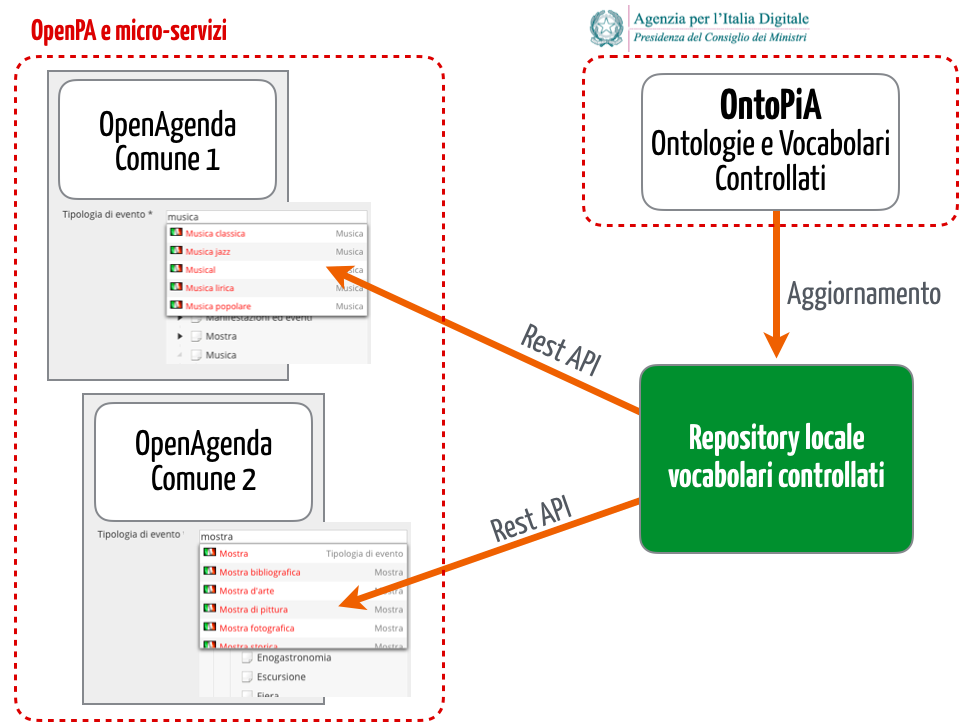

########################################################
Classi di contenuto per l'informazione pubblica della PA
########################################################

Tutte le applicazioni web che Opencontent offre agli enti pubblici sono basate su OpenPA, un framework che gestisce informazioni strutturate secondo il paradigma delle classi di contenuto.

L'obiettivo di questo manuale è documentare la progressiva evoluzione delle classi di contenuto, con un duplice obiettivo:

* strutturare i dati secondo ontologie e vocabolari controllari definiti da AgID

* allineare automaticamente tutti gli enti che adottano OpenPA al modello.

\ |IMG5|\ 

.. toctree::

   docs/Introduzione.rst
   docs/Istanze pilota.rst
   docs/Atti.rst
   docs/Eventi pubblici (CPEV-AP_IT).rst
   docs/Organizzazioni (COV-AP_IT).rst
   docs/Indirizzi (CLV-AP_IT).rst
   docs/Luoghi (POI-AP_IT).rst
   docs/Persone (CPV-AP_IT).rst
   docs/Prezzi e offerte (POT-AP_IT).rst
   docs/Punti di contatti (SM-AP_IT).rst
   docs/Ruoli (RO-AP_IT).rst
   docs/Strutture ricettive (ACCO-AP_IT).rst
   docs/Tempo (TI-AP_IT).rst
   docs/Unità di misura (MU-AP_IT).rst
   docs/Altre classi.rst
   docs/Internet of Things (IoT-AP_IT).rst
   docs/Vocabolari controllati.rst
